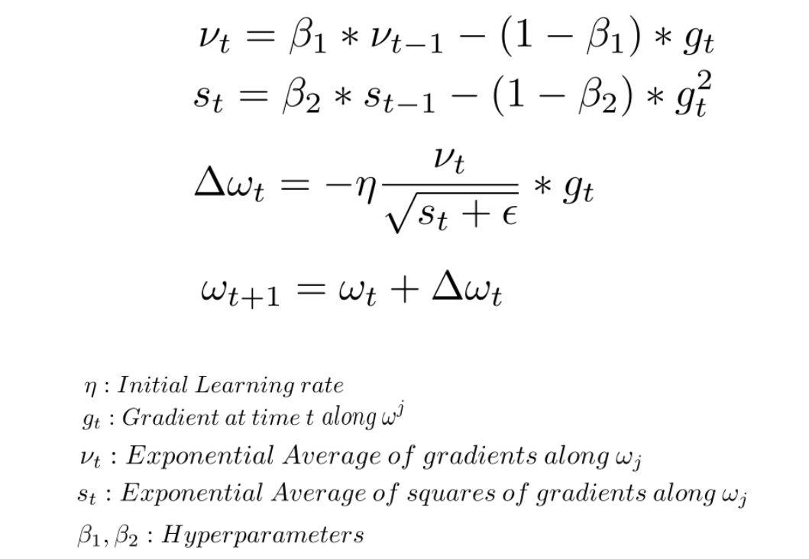

# 1. Előadás
### 1. Mi a mélytanulás? Miért mély?
A mélytanulás a gépi tanulás egyik formája, melynek során neurális hálózatok segítségével végzünk el egy feladatot (pl.: regresszió/osztályozás). 

A "mély" jelző a hálók méretére utal; ezen modellek rétegekből állnak, ahol az egyes rétegek az adatok más-más reprezentációjának felelnek meg. Ezen reprezentációk a mélyebb rétegek felé haladva egyre komplexebbek és például egy osztályozási feladat esetén egyre inkább szeparálják a különböző osztályokba tartozó adatpontokat. A rétegek száma sokszor több száz, vagy akár több ezer is lehet. Illetve fontos kiemelni, hogy bizonyos architektúrák esetén az egyes rétegekben elhelyezkedő neuronok száma is megnő - ezt nevezik a háló szélességének. Ugyanakkor a mélység és szélesség nem feltétlen egyenesen arányos.
### 2. Mi a mélytanulás kapcsolata a gépi tanulással?
A mélytanulás a gépi tanulásnak egy alfaja. Úgy lehet elképzelni, hogy a mélytanulás a bogár, míg a gépi tanulás a rovar. Minden bogár rovar, de nem minden rovar bogár. 

A mély tanulás a gépi tanulásból nőtte ki magát, leginkább akkor érdemes használni, amikor sok adat áll rendelkezésünkre, illetve az adatok közötti kapcsolatok nem lineárisak. Ezen kívül a gépi tanulással szemben - ahol manuálisan kell kiválasztani - a mély tanulás automatikusan választja ki a probléma megoldását tekintve releváns jellemzőket. A két megközelítés hasonló problémákat old meg, de a megoldás megvalósításában különböznek.
### 3. Mi a szimbolikus (szabály alapú) MI és a gépi tanulás kapcsolata?
A szimbolikus MI (nás néven szabályalapú MI) előre definiált szabályokra és logikai következtetésekre épül, azaz a rendszert a fejlesztő által meghatározott szabályok vezérlik.

Ezzel szemben a gépi tanulás adatvezérelt: a rendszer magától tanul mintákat az adatokból, anélkül, hogy explicit szabályokat adnánk meg.

Mindkét megközelítés a mesterséges intelligencia része, és bizonyos feladatoknál kiegészíthetik egymást, amit a **neuro-szimbolikus AI** próbál ötvözni.
### 4. Mi a túl- és alulillesztés? (overfitting, underfitting)
A tanítás eredményeként megfigyelhető jelenségek.

Underfitting: A modell nem volt képes megtanulni az adatok közötti összefüggéseket, így rossz performanciát mutat mind a tanító, mind a validációs/teszt adathalmazon. Ennek oka általában az, hogy a modell komplexitása nem elegendően nagy és/vagy a tanítóminták száma nem elegendő. 

Overfitting: A modell túltanulásának jelensége azaz az, amikor a modell szinte tökéletesen rátanult a tanítómintákra. Ennek eredményeképpen a modell általánosítóképessége romlik, így egy teljesen új minta esetén rossz teljesítményt mutat. Fontos kiemelni, hogy ilyenkor általában a validációs, illetve teszt adathalmazokon mutatott teljesítménye is rossz - kivéve akkor, ha a tanítóminta elég reprezentatív/"végtelen" sok, lásd: double-descent jelensége.
### 5. Mire jó a hibafüggvény?
Olyan matematikai függvény, amely segítségével megvizsgálhatjuk a modell kimenetének minőségét.

A függvénynek két bemenete van, a modell kimenete, illetve az elvárt kimenet. A függvény által visszaadott érték numerikus, amely azt mutatja, hogy mennyire tér el a modell kimenete az elvárt kimenettől.

A hibafüggvény helyes megválasztása kulcsfontosságú, hiszen tanítás során arra törekszik a modell, hogy ezt minimalizálja a súlyai változtatásával. Így a hibafüggvény segítségével irányítható a modell tanulása - pl.: kevesebbszer vétsen FP, mint FN hibát.

Fontos megjegyezni, hogy különböző feladatokra - pl.: regresszió, bináris vagy többosztályos klasszifikáció - különböző hibafüggvényeket kell használni.
### 6. Mi az a tenzor, mik a fő tulajdonságai? Milyen rangú tenzor szükséges a különböző adattípusokhoz?
A **tenzor** egy matematikai objektum, amely általánosítja a skalárokat, vektorokat és mátrixokat több dimenzióra. Egyszerűen fogalmazva: egy tenzor **többdimenziós tömb**, amely számokat tárol.

**Fő tulajdonságai:**
- **Rang(rank/order):** a dimenziók számát jelenti.
    - 0-rangú tenzor: skalár (pl.: `5`)
    - 1-rangú tenzor: vektor (pl.: `[1, 2, 3]`)
    - 2-rangú tenzor: mátrix (pl.: `[[1, 2], [3, 4]]`)
    - 3-rangú és nagyobb tenzor: többdimenziós tömb (pl.: képadatok: `height x width x channel`)
- **Alak (shape):** a tenzor dimenzióinak mérete, pl.: egy `28 x 28 x 3` kép.
- **Elemtípus:** a tenzorban tárolt adatok típusa (pl.: `float32`, `int64`)
### 7. Ismertesse a neuronhálókban alkalmazott alapvető vektor és mátrixműveleteket, és az ezekhez kapcsolódó feltételeket.
A neurális hálózatok számításai nagyrészt **vektor- és mátrixműveleteken** alapulnak:
**Alapvető műveletek:**
- **Vektor-mátrix szorzás:** `input_vector * weight_matrix`
    - Feltétel: `input_vector.shape[0] == weight_matrix.shape[1]`
- **Mátrix-mátrix szorzás:** `batch_input * weight_matrix`
    - Feltételek: `batch_input.shape[1] == weight_matrix.shape[0]`
- **Elemről elemre műveletek:** `arr_1 + arr_2`
    - Feltételek: a tenzorok alakja vagy broadcastolható legyen.
- **Transzponálás:** gyakran a dimenziók összehangolására, pl.:gradiens számításnál.
### 8. Aktivációs függvényekre miért van szükség a neurális hálózatokban?
Az aktivációs függvények segítségével viszünk nemlinearitást a modellbe. Erre azért van szükség, mert valós adatok esetén nagyon ritka, hogy az adatok közötti összefüggések lineárisak lennének. Ugyanakkor a modellek működését megvizsgálva látszik, hogy az aktiváció függvény nélkül a modell kimenete csupán a bemeneti értékek egy lineáris kombinációja lenne.
### 9. Mi az az SGD (Stochastic Gradient Descent)?
A Stochastic Gradient Descent a modell tanítására használt optimalizáló algoritmus. Segítségével dönthetjük el, hogy az egyes súlyokat milyen mértékben változtassuk meg  úgy, hogy a modell hibája csökkenjen.

Jellegzetessége, hogy az egyes súlyokhoz tartozó hibákat/gradienseket pontosan egy darab - véletlenszerűen választott - tanítóminta kiértékelését követően számolja ki. Ez egyébként általában hátrányos, hiszen egy tanítóminta nem feltétlen elegendően reprezentatív a tanítóadathalmazt tekintve, így zajossá teheti a tanítást. Ugyanakkor mivel csak egy adatpontra számolja ki a gradienst, így kevésbé költséges. Ezért, ha elegendő számítási erőforrás áll rendelkezésre, általában a Mini Batch Gradient Descent használata javasolt, melynek során M darab tanítómintára számolja ki az algoritmus a gradienst - ahol M < N, N a tanítóminták száma.
### 10. Mi az a backpropagation eljárás?
A **backpropagation** a mély tanulás egyik központi és legalapabb algoritmusa. Segítségével kiszámolható, hogy a modell bizonyos súlyai a hibafüggvény értékét mennyire befolyásolták.

Az algoritmus a matematikai deriválás láncszabályán alapul, futása során a hibát visszaterjeszti az egyes súlyokhoz rétegről rétegre. A backpropagation segítségével az optimalizáló algoritmusok (például SGD) frissíthetik a háló súlyait a hibafüggvény minimalizálása érdekében.

# 2. Előadás
## 2.1 Deep Learning hardware
### 1. Mi a különbség a játékos és professzionális célú GPU-k között?
A professzionális GPU-ok célja az, hogy megbízhatóak és pontosak legyenek - pl.: ECC memória (hibajavító) -, illetve bizonyos területen speciális támogatást nyújtsanak, pl.: AI/DL. Általában nagyobb memóriakapacitással rendelkeznek.

A játékos célú GPU-k általában a nyers teljesítményt veszik figyelembe, az a cél, hogy pl.: minél nagyobb legyen az FPS egy játék esetén. Általában olcsóbbak is, mint egy professzionális GPU, de emiatt például kevésbé stabilak is. Ezek inkább grafikus teljesítményre vannak szabva, mintsem numerikus stabilitásra.
### 2. Mi a GPU fő előnye? Bit felbontás, magok száma, órajel, számítási egységek, NVLink fogalmak.
A GPU-k előnye például egy CPU-val szemben abban rejlik, hogy képesek műveletek párhuzamos elvégzésére, amely felgyorsítja a nagy mátrixműveletek elvégzését. Ez például DL esetén jelentős, hiszen egy GPU képes egy egész batch-et párhuzamosan feldolgozni.

**Fogalmak:**
- **Bit felbontás:** Éebegőpontos számítások pontossága.
- **Magok száma:** A párhuzamos számításra képes processzormagok száma.
- **Órajel:** A GPU magok működési sebessége, meghatározza, hány műveletet képes elvégezni másodpercenként.
- **Számítási egységek:** Az a hardverkomponens, amely végrehajtja a számításokat. (pl.: CUDA cores)
- **NVLink:** NVIDIA gyors kommunikációs protokoll a GPU-k és a CPU vagy a GPU-k közti adatátvitelhez, gyorsabb, mint a PCIe.
### 3. Mik a legfőbb előnyei egy professzionális GPU szervernek?
A legfőbb előnyök a következők:
- **Több GPU párhuzamos használata:** Nagyobb modellek és batch-ek gyors feldolgozáshoz.
- **Nagy memória:** Segíti a nagy modellek és adatbatch-ek kezelését.
- **Stabilitás és pontosság:** ECC memória és megbízható hardver biztosítja a hibamentes számításokat.
- **Optimalizált szoftvertámogatás:** `CUDA`, `cuDNN`, AI/DL könyvtárok maximális teljesítményhez.
- **Hatékony hűtés és energiafelhasználás:** Stabil működés nagy terhelés mellett.
### 4. Milyen tároló egységek jöhetnek szóba egy nagyteljesítményű GPU szerverben?
A következő tároló egységek jöhetnek szóba:
- **HDD:** Nagy kapacitás, olcsó, lassabb.
- **SSD:** Gyorsabb, közepes kapacitás.
- **NVMe:** Nagyon gyors, alacsony késleltetés, ideális nagy adatmennyiséghez DL feladatoknál.
- **RAID tömbök:** Adatbiztonság és/vagy gyorsabb I/O.
### 5. Mik az alkotóelemei egy több GPU szervert tartalmazó MI infrastruktúrának?
Az alábbi alkotóelemek
- **GPU szerverek:** Több GPU-val, nagy memória- és számtási kapacitással.
- **Hálózat:** Nagy sávszélességű, alacsony késleltetésű kapcsolat (pl.: `NVLink`, In`finiBand).
- **Tárolórendszer:** Gyors adateléréshez SSD/NVMe tömbök.
- **Kezelő- és menedzsment szoftverek:** Orchestration (pl.: `Kubernetes`), driver és könyvtárkezelés (`CUDA`, `cuDNN`).
- **Energia- és hűtésrendszer:** Stabil működés nagy terhelés mellett.
### 6. Mik a előnyei és hátrányai a játékos célú GPU-k deep learning célokra való használatának?
Az első kérdésre adott válasz már bemutatta a különbséget a két GPU között. Az előny ilyenkor az, hogy ha nincs professzionális GPU-ja a fejlesztőnek, akkor használhatja a játékos GPU-t is modellek tanítására, ezzel felgyorsítva a folyamatot. Ugyanakkor a játékos GPU-k pontatlanabbak, mint a professzionális GPU-k, így ebben ez kihathat a modell által tanult súlyokra, így a performanciára is. Azaz játékos GPU használatánák fennáll annak az esélye, hogy nem egy optimális modellt kap a fejlesztő.

## 2.2 Deep Learning software 
### 1. Mi a konténerizáció? Miért előnyös Deep Learning rendszerek esetén a konténerizáció?
A konténerizáció az a folyamat, melynek során egy szoftvercsomagot egy konténerbe csomagolunk. Ebben a konténerben a szoftvercsomaghoz tartozó összes függőség rendelkezésre áll, illetve önmagában a konténerben fog futni a szoftver a többi processztől függetlenül. Előnye a virtualizációval szemben, hogy nem egy teljes OS-t emulál, hanem az OS gazda kerneljét használja, így könnyű és gyors tud lenni.

A DL esetén a következő okokból előnyös:
- Függőségi konfliktusok (`Dependency Hell`)
- Eltérő környezetek (pl.: `dev` vs. `prod`)
- Nehézkes csapatmunka
- Rossz reprodukálhatóság
### 2. Mik az elsődleges mélytanuló keretrendszerek?
- **Pytorch:** Dinamikus számítási gráf, könnyen debugolható, népszerű kutatói körökben.
- **Tensorflow:** Statikus számítási gráf, ipari környezetben elterjedt, támogatja a deployment-et szerverre és mobilra.
### 3. Mi az az MLOps? Mik a fő komponensei?
Az `MLOps`, másnéven `Machine Learning Operations` a gépi tanulási modellek fejlesztésének, telepítésének és üzemeltetésének folyamatait standardizáló és automatizáló gyakorlat.

**Fő komponensei:**
- **Verziókezelés:** Kód, adat és modellek követése.
- **CI/CD pipeline:** Automatikus build, teszt és deploy folyamatok.
- **Monitoring:** Modell teljesítményének, drift és hibák követése.
- **Automatizált training és retraining:** Modell frissítése új adatok alapján.
- **Infrastruktúra menedzsment:** Konténerek, GPU/CPU erőforrások kezelése.
### 4. Mi az a SLURM, Kubernetes és Docker konténerizáció? Melyiket, mikor használjuk?
- **Docker:** Konténerizációs platform, amely izolált környezetben futtatja a szoftvereket. Fejlesztéskor, teszteléskor és kisebb GPU/CPU környezetekben használt.
- **Kubernetes:** Konténer-orchestration rendszer, amely több Docker konténer menedzselését és skálázását teszi lehetővé. Használjuk nagyléptékű, több szerveres, production környezetben.
- **SLURM:** Cluster menedzsment és ütemező HPC (`High Performance Computing`) környezetekhez. Nagy számításigényű feladatokhoz használt, pl.: több GPU-s deep learning modellek futtatására klaszteren.

## 2.3 Deep Learning alapú osztályozás és regresszió
### 1. Mi az a regresszió? Mondj pár példát regressziós feladatra.
A regressziós feladat célja, hogy bemeneti jellemzők alapján egy folyamatos numerikus értéket becsüljön a modell. Pl.: Ház jellemzői alapján a ház ára.
### 2. Mi az az osztályozás? Mondj pár példát osztályozási feladatra.
Az osztályozási feladat célja, hogy a bemeneti jellemzők alapján a bemeneti adatpontot adott osztályba sorolja - felügyelt tanítás esetén az osztályok adottak, nem felügyelt esetén a cél a klaszterek kialakítása. Pl.: A képen látható állat kutya vagy macska.
### 3. Milyen veszteségfüggvényt és aktivációs függvényt használsz bináris, többosztályos (multiclass) és többcímkés (multilabel) osztályozás esetén?
**Bináris klasszifikáció:**
- **Veszteségfüggvény:** `Binary Crossentropy`
- **Aktivációs függvény:** `Sigmoid`

**Többosztályos klasszifikáció:**
- **Veszteségfüggvény:** `Categorical Crossentropy`
- **Aktivációs függvény:** `Softmax`

**Többcímkés osztályozás:**
- **Veszteségfüggvény:** `Binary Crossentropy` - minden címkére külön számolva
- **Aktivációs függvény:** `Sigmoid` - minden címkéhez külön
### 4. Mi a különbség a többosztályos klasszifikáció (multiclass classification) és a többcímkés klasszifikáció (multilabel classification) között?
Többosztályos klasszifikáció esetén a bemeneti minta több osztály közül pontosan egy osztályba tartozik, pl.: a képen látható állat kutya, macska, egér vagy ló.

Többcímkés klasszifikáció esetén a bemeneti minta több osztály közül egy vagy több osztályba tartozik, pl.: a képen látható személy érzelmi állapota boldog és izgatott.
### 5. Milyen veszteségfüggvényt és aktivációs függvényt használsz regresszió esetén?
- **Veszteségfüggvény:** `RMSE`, `MAE`
- **Aktivációs függvény:** `ReLU`, illetve annak változatai. A kimeneti rétegben általában nincs aktivációs függvény. Ha a kimenet pozitív kell, hogy legyen, használható `ReLU` vagy annak változatai.
### 6. Mi az a one-hot encoding?
Bináris vagy többosztályos klasszifikációnál használt arra, hogy vektorosan jelöljük, hogy egy adott bemeneti minta melyik osztályba tartozik. Például ha 10 osztály van és a minta az 5. osztályba tartozik, akkor a címke one-hot encoded formája: `[0, 0, 0, 0, 1, 0, 0, 0, 0, 0]`.

Erre a hibafüggvény miatt van szükség, amely bemenetén két azonos méretű vektort vár. Ez egy `1x10`-es vektor a fenti esetben, ahol a címke a fenti, míg a modell kimenete egy 10 elemű vektor, ahol az egyes komponensek az egyes osztályokba való tartozás valószínűségét jelölik.
### 7. Mi az a multi-hot encoding?
A többcímkés osztályozásnál használt, hasonló, mint az előbb bemutatott `one-hot encoding`. Annyiban különbözik, hogy itt a címke több komponense is lehet `1`, annak függvényében, hogy a bemeneti minta mely osztályokba tartozik.
### 8. Hogyan kell megadni a veszteségfüggvényeket egy olyan több kimenetű Keras modell fordításakor (`model.compile()`), amely egyszerre végez regressziót és klasszifikációt?
Meg kell adni, hogy a modell mely veszteségfüggvényt használja a regresszióhoz, illetve a klasszifikációhoz. Ezt egy `dictionary`-t használva tehetünk meg.

```python
model.compile(
    optimizer='adam',
    loss={
        'regression_output': 'mean_squared_error',
        'classification_output': 'categorical_crossentropy'
    }
)
```
### 9. Milyen célt szolgál a tanító, validációs és teszt adathalmaz használata a modell tanítása során?
- **Tanító adathalmaz:** Az adathalmaz azon része, amellyel a modell tanítását végezzük. Ezen adatok segítségével állítja be/tanulja meg a modell a súlyait, illetve tanulja meg az adatok közötti összefüggéseket. Célszerű minél reprezentatív adathalmazt választani azért, hogy a modell generalizáló képessége erős legyen.
- **Validációs adathalmaz:** A tanítás során használt adathalmaz, amellyel azt mérjük, hogy a modell hogyan teljesít olyan adatokon, amelyeket még nem látott. Ugyanúgy számolunk hozzá hibát, de a súlyokat **nem** változtatjuk meg ezen hiba alapján. Olyan módszerek alapja a validációs hiba, mint például az `early stopping` - a tanítás leállítása akkor, ha a modell teljesítménye a validációs adathalmazon nem javul megadott számú `epoch` után. Az `early stopping` segíti elkerülni a túltanulást.
- **Teszt adathalmaz:** Azon adathalmaz, amellyel azt mérjük, hogy a betanított modell hogyan teljesít egy olyan adathalmazon, amelyeket még - a tanítás során -  nem látott. Gyakorlatilag a modell általánosítóképességét mérhetjük vele.

# 3. Előadás
## 3.1 Backpropagation eljárás
### 1. Mi történik a "forward pass" (előre terjesztés) során? Ismertesd az adatáramlás útját!
A `forward pass` a backpropagation eljárás - illetve általánosan a neurális hálózatok használatának - azon folyamata, melynek során a háló a bemenetén kapott adatot feldolgozza, majd a kimeneti rétegben visszaadja a kimenetet.

A feldolgozás során az adat a neurális hálózat rejtett rétegein megy keresztül, ahol minden réteg az előző réteg kimenetét kapja meg bemenetnek, majd a saját súlyai, `bias`-ei, illetve aktivációs függvényeinek függvényében alakít kimenetté, amelyet a következő rétegnek ad tovább. A kimeneti réteg az utolsó rejtett réteg kimenetét összegzi.

A forward propagation célja tehát a háló válaszának kiszámítása, amelyet később a backpropagation során használ fel arra a háló, hogy súlyait megfelelően módosítsa.
### 2. Mi a "backward pass" (visszaterjesztés) alapvető célja? Mit számolunk ki és miért?
A `backward pass` célja annak kiszámolása, hogy a háló egyes súlyai -, melyek a háló különböző rétegeinek különböző neuronjaihoz tartoznak - milyen mértékben járultak hozzá a kimenethez. Ezen információ birtokában a háló tudja úgy módosítani a súlyait, hogy a következő `forward pass` során a kimenete már közelebb legyen az elvárt kimenethez.

Matematikai szempontból a súlyhoz tartozó hiba gradiensét számoljuk ki: `dC/dwij`, ahol `C` a költségfüggvény, míg `wij` az `i.` réteg `j.` neuronja. Ezen gradiens mutatja, hogy a súly növelése vagy csökkentése milyen mértékben változtatná a hibát, és ezen alapul a súlyok frissítése a `gradient descent` segítségével.
### 3. Nevezz meg egy-egy tipikus hibafüggvényt regressziós és osztályozási feladatokhoz!
**Regresszió**
- `RMSE - Root Mean Squared Error`
- `MAE - Mean Absolute Error`
**Osztályozás**
- `Binary Crossentropy`: Bináris klasszifikáció, Többcímkés osztályozás
- `Categorical Crossentropy`: Többosztályos klasszifikáció
### 4. Definiáld röviden az epoch, a batch és a mini-batch fogalmakat!
- `epoch:` A neurális hálózat tanításnak egy ciklusa, melynek során a háló az összes adatot látta egyszer.
- `batch:` A tanítás során az adatok egy részhalmaza, amelyet a háló egyszerre dolgoz fel. A gradiens és így a hibavisszaterjesztést az egész `batch`-en számolt hiba alapján végzi. Megjegyzés: Sokszor `batch` alatt az egész adathalmazt értik, lásd következő kérdés 'tiszta batch'.
- `mini-batch:` Hasonló, mint a `batch`. A különbség annyi, hogy `mini-batch` alatt az adathalmaz egy jelentősen kisebb részhalmazát kell érteni. A `batch`-hez hasonlóan a háló a `mini-batch` kiértékelését követően végzi el a hibavisszaterjesztést.
### 5. Miért előnyösebb a mini-batch alapú tanulás a tiszta batch vagy a Stochastic Gradient Descent módszerekkel szemben?
A tiszta batch alapú megközelítés esetén a hibavisszaterjesztés az egész adathalmaz kiértékelése után történik - azaz a háló az összes adatra elvégzett egy `forward pass`-t. A - tanító - adatok eloszlását tekintve ez a legoptimálisabb, hiszen a háló ha ezen kiszámolt hiba alapján változtatja súlyait, akkor optimális lépést végez, hiszen minden adatot és az azokon vétett hibát figyelembe vett. Ugyanakkor az egész adathalmaz kiértékelése - főleg nagy adathalmaz esetén - költséges.

A költséggel kapcsolatos problémára ad megoldást a `Stochastic Gradient Descent (SGD)`, amely a hibavisszaterjesztést egy darab tanítóadat kiértékelését követően végzi el a háló. Ez a költség problémáját megoldja, ugyanakkor nagyon torzíthatja a tanítást, hiszen szinte 0 annak az esélye, hogy egy tanítóminta eléggé reprezentatív az adathalmazt tekintve. Azaz lehet, hogy ilyen esetben a súly megváltoztatása az egész adathalmazt tekintve rontja a modell teljesítményét.

A `mini-batch` alapú tanítás a két előző metódus kompromisszuma; költséghatékony, hiszen az egész adathalmaz helyett annak egy részhalmazát használja fel a hibavisszaterjesztéshez. Emellett pedig a modell nagyobb eséllyel kerül globálisan jobb helyre a hibafelületet tekintve, hiszen az adatok egy részhalmaza nagyobb valószínűséggel reprezentálja - jobban - az tanítómintákat. A módszer előnye emellett az is, hogy zajt visz a tanításba, így a modell könnyebben tud kiszabadulni például lokális minimumokból.
### 6. Mi az aktivációs függvény, és miért elengedhetetlen a használata a rejtett rétegekben?
Az aktivációs függvény egy olyan függvény, amely nemlinearitást visz bele a modellbe. Erre azért van szükséges, mert enélkül a kimenet a bemenet egy lineáris kombinációja lenne, azaz a modell nem lenne képes olyan problémákat megoldani, ahol a bemeneti jellemzők közötti kapcsolatok nem lineárisak.
### 7. Mi a tanulási ráta (learning rate) szerepe a modell tanítása során? Mi történik, ha túl magas vagy túl alacsony az értéke?
A `learning rate`-tel adható meg egy hálónak, hogy a tanítás során a háló súlyait milyen mértékben változtassa meg. A `backpropagation` eredményeként előálló gradiens értékét kell beszorozni a `learning rate`-tel: `w = w - learning_rate*gradient`.

A `learning rate` megfelelő megválasztása kulcsfontosságú. Túl alacsony érték esetén a modell súlyai lassan konvergálnak az optimális értékekhez, míg túl nagy érték esetén a tanulás instabil, a modell divergál.
### 8. Mi az optimizer (optimalizáló algoritmus) feladata a tanítási folyamatban?
Az `optimizer` feladata az, hogy meghatározza, hogy a háló súlyait a kiszámított gradiens alapján hogyan változtassuk meg.

Emellett segíti abban a hálót, hogy hatékonyan és stabilan konvergáljon a költségfüggvény minimuma felé. Fejlettebb algoritmusok -, mint például `Momentum` alapú, `RMSProp` vagy `Adam` - képesek figyelembe venni a hibafelület jellegzetességeit is tanítás során, mellyel tovább növelik a folyamat hatékonyságát.
### 9. Milyen elemek határozzák meg egy neurális hálózat méretét byte-ban kifejezve? (Gondolj a súlyokra és a biasokra és ezek felbontására.)
Súlyok és `bias`-ek, illetve ezen paraméterek tárolásához használt numerikus típusok méretei - pl.: `float16 = 2 byte`, `float32 = 4 byte`, `float64 = 8 byte` 
### 10. Mi a bias szerepe egy neuronban, és miért van rá szükség?
A `bias` szerepe egy neurális hálózatban az, hogy lehetővé tegyem hogy az aktivációs függvény kezdőpontja elmozduljon - ne mindig az origoban legyen. A `bias` is segít abban, hogy a háló összetettebb, nemlineáris mintázatokat tanuljon meg.

## 3.2 Veszteségfüggvények, optimalizációs eljárások, aktivációs függvények
### 1. Mi az az elenyésző gradiens? Mikor jelentkezik és hogy lehet elkerülni?
Az elenyésző gradiens - `vanishing gradient` - jelensége az, amikor a hibavisszaterjesztés során a kiszámított gradiens nagyon kicsi, vagy közel nulla, és így a későbbi (számozásban kisebb indexű) rétegekhez érve már szinte 0 lesz, ezzel azt elérve, bizonyos súlyok ne változzanak a tanítás során.

A jelenség leginkább mély neurális hálózat esetén jelentkezik, elkerülésére több módszer létezik:
- **Megfelelő aktivációs függvények alkalmazása:** A telített - pl.: `sigmoid`, `tanh` - függvények helyett telítetlen/egyik oldalról telített függvények használata, pl.: `ReLU`, `Leaky ReLU`
- **Architekturális változtatások:** Lásd: `RNN (Recurrent Neural Network)` -> `LSTM (Long Short-Term Memory)` vagy `Skip connection`-ök alkalmazása (`ResNet`)
### 2. Mi az a halott neuron? Mikor jelentkezik és hogy lehet elkerülni?
A halott neuron a `ReLU` aktivációs függvény sajátosságaihoz kapcsolódik. Olyan neuron, amelynek kimenete minden bemenetre nulla, ezért soha nem aktiválódik, így a tanítás során nem frissülnek a súlyai.

Több féle képpen kerülhető el:
- **`ReLU` variánsok:** `Leaky ReLU`
- **A súlyok megfelelő inicializálása**
### 3. Mi a Softmax aktivációs függvény elsődleges szerepe egy neurális hálózat kimeneti rétegében?
A `Softmax` szerepe az, hogy a háló kimenetéből egy valószínűségi eloszlást csináljon. Osztályozásnál használjuk, ahol például értelmezhető úgy a `Softmax` által transzformált kimenet, hogy a háló x valószínűséggel mondja azt, hogy a képen egy cica van.
### 4. Miért előnyösebb a Kereszt-Entrópia (Cross Entropy) a Négyzetes Hibával (MSE) szemben osztályozási feladatoknál?
Azért előnyösebb, mert a `Cross Entropy` az `MSE`-vel szemben azt is bünteti, hogy a háló milyen mértékben tévedett. Azaz előbbi figyelembe veszi, hogy a modell milyen magabiztossággal választott és ennek megfelelően jobban bünteti, ha rosszul, míg utóbbi nem teszi ezt meg.
### 5. Melyik gradiens süllyedési variáns számítja ki a gradienst a teljes tanító adathalmazon egyetlen paraméterfrissítéshez?
A `full-batch gradient descent`.
### 6. Mi az Adam optimalizáló legfőbb jellegzetessége, amely megkülönbözteti az RMSProp-tól és a momentum módszertől?
Az `Adam` egy olyan optimalizáló, amely kombinálja a `Momentum` és az `RMSProp` előnyeit. Előbbi figyelembe veszi a gradiens irányát, így simább és gyorsabb konvergenciát eredményez. Utóbbi adaptívan skálázza a tanítási rátát a gradiens nagysága szerint, így egy gyorsabb és stabilabb tanítást eredményezve.
### 7. Melyik tanulási ráta ütemező (learning rate scheduler) változtatja a tanulási rátát egy koszinusz függvény lefutását követve egy adott cikluson belül?
A `Cosine Annealing`.
### 8. Mi a hasonlóság és mi a különbség a hiperbolikus tanges és a szigmoid között?
Hasonlóság, hogy mindkét aktivációs függvény balról és jobbról is telített. Különbség, hogy más az értékkészletük, illetve az, hogy a `sigmoid` kimenete minden esetben pozitív.
### 9. Mi a fő különbség a Mini-Batch Gradient Descent és a Stochastic Gradient Descent (SGD) között?
`Stochastic Gradient Descent (SGD)` esetén pontosan egy tanítóminta kiértékelése után történik a súlyok frissítése, míg `Mini-Batch Gradient Descent` esetén a `mini-batch` kiértékelése után, amely `M<N` elemű -, ahol `M` a `mini-batch` mérete, `N` a tanító adathalmaz mérete.
### 10. Az Adam optimalizáló frissítési képleteiben szereplő m^t és v^t mit jelentenek?
- **m^t:** `RMSProp` tag.
- **v^t:** `Momentum` tag.

Megjegyzés: `v^t=v^t`, `m^t=s^t`

### 11. Melyik aktivációs függvény a de facto szabvány a rejtett rétegekben, különösen a konvolúciós neurális hálózatokban, a számítási hatékonysága és a vanishing gradient probléma enyhítése miatt?
`ReLU`
### 12. Egy bináris osztályozási feladatnál a modell egy valójában spam (címke: 1) e-mailre 0.1 valószínűséget jósol. Hogyan viszonyul egymáshoz a Bináris Kereszt-Entrópia és az MSE által számított hiba ebben az esetben?
A Bináris Kereszt-Entrópia (`Binary Crossentropy`) által számított hiba ebben az esetben nagyobb, mint az `MSE` által számított hiba, hiszen az előbbi azt is bünteti, hogy a modell milyen biztossággal prediktált rosszul.

# 4. Előadás
## 4.1 Súlyinicializálás, regularizáció
### 1. Melyik aktivációs függvényhez tervezték kifejezetten a 'He' súlyinicializálást?
`ReLU` aktivációs függvényhez.

Rövid indok: A `ReLU` aktiváció a negatív bemeneteket kinulázza, így a hagyományos inicializációs eljárások (pl.: `Xavier-Glorot`) túl kicsivé tennék a varianciát a rétegekben. A `He` inicializáció ezt javítja ki, ezzel elérve a jel/gradiens stabil áramlását a rétegekben.
### 2. A standard Xavier inicializálási képlet szerint (egyenletes eloszlás -(1/sqrt(n))...(1/sqrt(n)) tartományban) mi történik a lehetséges súlyértékek tartományával, ha a bemeneti csomópontok száma (n) növekszik?
A kezdeti súlyok `n` növekedésével csökkennek. (Ha `n` nő, akkor `1/sqrt(n)` csökken.)
### 3. Mi a regularizáció elsődleges célja a gépi tanulásban?
Annak megakadályozása, hogy a háló túltanuljon/`overfitting` megakadályozása, ezzel pedig nőjön a háló általánosítóképessége.
### 4. Melyik paraméter normabüntetés ismert arról, hogy ritka (sparse) megoldásokat eredményez, azaz egyes súlyokat pontosan nullára állít?
`L1`/`Lasso` regularizáció.
### 5. Mit eredményez az L1 és mit az L2 regularizáció a modell súlyaira nézve?
Az `L1`/`Lasso` regularizáció - ahogyan azt az előző kérdés is megfogalmazta - "sparse"/ritka súlyokat eredményez, hiszen arra ösztönzi a hálót, hogy bizonyos súlyokat nullára állítson. Ezzel szemben az `L2`/`Ridge` regularizáció megakadályozza a hálót abban, hogy bizonyos súlyai extrém nagyok legyenek.
### 6. Hogyan módosítja az L2 regularizáció (weight decay) a súlyok frissítését egyetlen gradiens lépés során?
$L_{\text{total}}=L_{\text{eredeti}} + \frac{\lambda}{2}\sum_i w_i^2$

A fenti kifejezésből a második tag a regularizációs tag. Ennek deriváltja adott súlykomponenst véve: $\frac{\delta}{\delta w_i}\frac{\lambda}{2}w_i^2 = \lambda w_i$.

Azaz a súlyfrissítést tekintve $w_i$-re: $w_i \leftarrow w_i - \eta(\frac{\delta L_{\text{eredeti}}}{\delta w_i} + \lambda w_i)$.

Összefoglalva minden egyes lépésben - az adott súly nagyságával arányosan - csökkenti a súlyt az `L2` regularizáció.
### 7. Mi a „korai leállítás” (early stopping) regularizációs technika alapvető működési elve?
Az `early stopping` lényege, hogy tanítás közben a validációs adathalmazon is mérjük a modell hibáját. Ha az itt mért hiba nem javul egymást követő `x` epoch-on keresztül, akkor a tanítást leállítjuk - `x` egy előre beállított hiperparaméter. Ezzel gyakorlatilag még időben, az előtt leállítjuk a tanítást, mielőtt a modell még túltanult.
### 8. A dropout technikát melyik ensemble módszer egy számításilag hatékony közelítéseként lehet értelmezni?
`Bagging`/`Bootstrap aggregating`: Sok kisebb, különböző hálót tanítunk - az eredeti adathalmazból mintavételezett adatokon (többszörös `bootstrap` minták) -, majd ezek előrejelzéseit átlagoljuk.
### 9. A normalizált Xavier inicializálás képlete (egyenletes eloszlás a -(sqrt(6)/sqrt(n+m))...(sqrt(6)/sqrt(n+m)) tartományban). Mit jelöl a képletben az 'm' változó?
`m` következő réteg neuronjainak a száma.

Megjegyzés: `n` az előző réteg neuronjainak a száma.
### 10. Miért nem szokták a torzítási (bias) paramétereket regularizálni a paraméter normabüntetésekkel (pl. L1, L2)?
A regularizáció célja a modell komplexitásának csökkentése és a túltanulás elkerülése a súlyok révén. A `bias` egyrészt nem növeli a modell komplexitását, másrészt a regularizálása torzíthatná a modell kimenetét, illetve csökkenthetné a tanítás hatékonyságát, hiszen a neuronok kimenete folyamatosan "lecsökkentett" lenne.
### 11. A képek elforgatása vagy eltolása a tanító adathalmazon belül melyik regularizációs stratégiára példa?
Adataugmentáció.
### 12. Mi történik, ha túl kicsi vagy túl nagy súlyokkal incializálunk egy neurális hálózatot?
Túl kicsi súlyok esetén a `vanishing gradient` jelensége, míg túl nagy súlyok esetén az `exploding gradient` jelensége lép fel. Mindkettő a tanítást teszi nehezzébé/lehetetleníti el.
### 13. Mik az elsődleges regularizációs technikák neurális hálózatokban?
- `L0`, `L1 (Lasso)`, `L2 (Ridge)`, `L-inf` regularizáció
- `Early stopping`
- `Dropout`
- `Batch/Layer Normalization`
- `Data augmentation`
- `Residual connections`
### 14. Hasonlítsa össze a DropOut és a BatchNorm regularizcáiós technikákat?
A két regularizációs technika mind működésben, mind hatásban különbözik. A `Dropout` a tanítás során véletlenszerűen kikapcsol bizonyos neuronokat - inferencia során nem aktív. Ezzel gyakorlatilag azt előzi meg, hogy a hálóban bizonyos neuronok tanuljanak meg "mindent" és így csökkenti a túlilleszkedést. Természetesen ez a tanítás gyorsaságát is csökkenti.

Ezzel szemben a `Batch Normalization` minden batch-re kiszámítja az aktivációk átlagát és szórását, majd normalizálja ezeket és opcionálisan skálázza/eltolja őket. Kisebb mértékben járul hozzá a háló túlilleszkedésének megakadályozásához, ugyanakkor növeli a gradiens stabilitását. `Batch Normalization` alkalmazásával növelhetjük a tanítás gyorsaságát, illetve a `Dropout`-tal szemben inferencia közben is használt - ilyenkor a számításokat különböző statisztikák alapján végzi el.
### 15. A Batch Normalization eljárás esetén hogyan érdemes a mini-batch méretet megválasztani? Miért?
Célszerű minél nagyobbra megválasztani. Ennek oka, hogy a `Batch Normalization` a `batch` aktivációinak átlagát és szórását használja a normalizációhoz. Ahhoz, hogy ezek a statisztikák reprezentálják az egész adathalmazt, a `batch`-nek elég nagy számú mintát kell tartalmaznia. Ha a `batch` mérete túl kicsi, akkor az átlag és a szórás értékei zajosak lehetnek, ami instabil tanuláshoz vezet.

# 6. Előadás
## 6.1 Keras alapok, hiperparaméter optimalizáció
### 1. Mi különbözteti meg a hiperparamétereket a modell paramétereitől a mélytanulás kontextusában?
A hiperparaméterek alatt azon paramétereket értjük, amelyek magát a tanítás folyamatát befolyásolják, mint például az epoch-ok száma, batch mérete vagy akár a learning rate.

A modell paraméterei alatt a modellhez expliciten kapcsolódó paramétereket értjük, mint például a modell súlyainak, illetve bias-einek az értékei. Ezen paraméterek a tanítás során változnak.
### 2. Hogyan definiálsz Keras-ban egy neurális hálózatot? Hogyan tanítod be a hálózatot?
A Keras-ban a hálózatot leggyakrabban a Sequential API vagy a Functional API segítségével definiáljuk. A Sequential API-val egymás után fűzött rétegeket hozunk létre, meghatározva a rétegek típusát, neuronszámát és aktivációs függvényét.

```python
from tensorflow.keras.models import Sequential
from tensorflow.keras.layers import Dense

model = Sequential([
    Dense(64, activation='relu', input_shape=(input_dim,)),
    Dense(32, activation='relu'),
    Dense(num_classes, activation='softmax')
])
```

A hálózat tanítása előtt a modell kompilálni kell, ahol megadjuk az optimalizálót, a veszteségfüggvényt és a teljesítménymérő metrikákat.

```python
model.compile(optimizer='adam',
              loss='categorical_crossentropy',
              metrics=['accuracy'])
```

Ezután a `fit()` metódussal tanítjuk a hálózatot, megadva az adatokat, az epoch-ok számát, a batch méretét és opcionálisan a validációs adathalmazt.

```python
model.fit(X_train, y_train, epochs=10, batch_size=32, validation_split=0.2)
```

### 3. Mi a legfontosabb tényező a sikeres modell ensemble (modell együttes) létrehozásához?
A sikeres modell ensemble legfontosabb tényezője a modellek különbözősége, azaz hogy eltérő hibákat kövessenek el. Ez biztosítja, hogy az együttes jobb általánosítást érjen el, mintha egyetlen modellt használnánk. Diverzitást elérhetünk különböző architektúrákkal, hiperparaméterekkel vagy adatrészletekkel.
### 4. Milyen esetben választanád elsődlegesen a modell-parallelizmust az adat-parallelizmussal szemben?
Túlságosan nagy méretű modellek esetén, azaz amikor a modell túl nagy ahhoz, hogy egyetlen GPU memóriájába beleférjen.

Ilyenkor az adatparallelizmussal szemben -, ahol a teljes modellt minden eszközön futtatjuk, de különböző adatbatch-ekkel - a modell különböző részeit több eszköz között osztjuk szét.
### 5. Mi az elsődleges célja a vegyes pontosságú (mixed-precision) tanításnak (pl. `mixed_float16`) ahelyett, hogy a teljes tanítási folyamat során csak `float16`-ot használnánk?
Az, hogy gyorsítsa a számításokat és csökkentse a memóriaigényt, úgy, hogy közben megőrizze a numerikus stabilitást.
### 6. A KerasTuner esetében mi a modellépítő funkció (vagy `HyperModel` osztály) feladata?
A feladata az, hogy definiálja a modell architektúráját és megadja, mely hiperparaméterek hangolhatók. A KerasTuner ezt a függvényt hívja meg minden próbálkozásnál, hogy különböző hiperparaméter-kombinációkkal új modellt hozzon létre és kiértékeljen.
### 7. Melyik Keras API biztosítja a legnagyobb rugalmasságot, lehetővé téve a nem aciklikus gráfstruktúrájú modellek létrehozását, de cserébe elveszít olyan funkciókat, mint a modell topológiájának ábrázolása?
Model Subclassing API.
### 8. A Keras funkcionális API-ban mit reprezentál egy `Input` objektum?
Az `Input` objektum a modell bemenetét reprezentálja.
### 9. Mi az `EarlyStopping` callback elsődleges funkciója a Kerasban?
Az `EarlyStopping`, mint regularizációs technika megvalósítása, azaz a modell tanításának leállítása, ha annak a teljesítménye egy adott metrikán (pl.: validációs adathalmazon mért pontosság) nem javulna előre magadott számú epoch után.
### 10. Egyedi tanítási lépés definiálásakor TensorFlow-ban miért a `tf.GradientTape()` kontextuson belül hajtjuk végre a forward pass-t?
Azért, mert a `GradientTape` csak így tudja automatikusan nyomonkövetni azokat a műveleteket, amelyekhez később gradiensszámításra lesz szükség a backpropagation során.
### 11. Mi az `int8` kvantálás fő célja?
A modell méretének és számítási igényének csökkentése, miközben a teljesítmény (pontosság) csak minimálisan romlik.
### 12. A Keras `Model` alosztályosításának mik a korlátai egy funkcionális modellhez képest?
A `Model` alosztályosítása (Model Subclassing API) nagyobb rugalmasságot ad, de elveszítünk több kényelmi funkciót, amit a funkcionális API biztosít. Például:
- Nincs automatikus topológia-levezetés
- Nem működik a `model.summary()` és a grafikus megjelenítés (`plot_model()`) teljes funkcionalitása
- Nehézkes mentés és betöltés
- Korlátozott újrafelhasználhatóság
## 6.2 PyTorch alapok, tenzorok, data loaderek, hiperparaméter optimalizáció
### 1. Hogyan definiálsz PyTorch-ban egy neurális hálózatot? Hogyan tanítod be a hálózatot?
Egy modell létrehozásához először egy osztályt kell létrehozni, amit az `nn.Module`-ból származtatunk le. Ennek `__init__` metódusában kell deklarálni a modell architektúráját felépítő rétegeket, majd a `forward` metódusában kell megadni, hogy a bemeneti adat hogyan halad végig a hálón.

```python
import torch
import torch.nn as nn
import torch.nn.functional as F

class SimpleNet(nn.Module):
    def __init__(self, input_dim, num_classes):
        super(SimpleNet, self).__init__()
        self.fc1 = nn.Linear(input_dim, 64)
        self.fc2 = nn.Linear(64, 32)
        self.fc3 = nn.Linear(32, num_classes)

    def forward(self, x):
        x = F.relu(self.fc1(x))
        x = F.relu(self.fc2(x))
        x = F.softmax(self.fc3(x), dim=1)
        return x

input_dim = 100
num_classes = 10
model = SimpleNet(input_dim, num_classes)
```

A modell tanításához szükséges egy veszteségfüggvény, illetve egy optimizer megadása. Tanítás során az adathalmazon végigiterálva a modell bemenetére adjuk az adatot, majd a kimenetét, illetve az elvárt kimenetet megadjuk a veszteségfüggvénynek. Ezt követően a `loss.backward()`, illetve `optimizer.step()` segítségével végezhetjük el a hibavisszaterjesztést, majd a súlyok frissítését.

```python
def train(...):
    # Init training, call model.to(device), model.train() etc...
    for epoch in range(num_epochs):
        optimizer.zero_grad()

        outputs = model(inputs)

        loss = loss_fn(outputs, targets)

        loss.backward()
        optimizer.step()
```
### 2. Mi a `torch.autograd` elsődleges feladata a PyTorch keretrendszerben?
A `torch.autograd` a PyTorch által készített automatikus differenciáló csomag. Így elsődleges feladata a tanítás során a gradiensek automatikus kiszámolása, amelyet egy számítási gráf felépítésével végez el.
### 3. Egy tipikus PyTorch tanítási lépésben mi a helyes sorrendje a hibavisszaterjesztés és a paraméterfrissítés műveleteinek?
Először a hibavisszaterjesztést kell elvégezni, amellyel kiszámítjuk az egyes súlyokhoz tartozó gradienseket. Ezt követően az optimizer ezek segítségével frissíti a modell paramétereit.
### 4. Egyedi neurális hálózat létrehozásakor a PyTorch-ban, az `nn.Module` osztály melyik metódusát kell felülírni a hálózaton áthaladó adatokkal végzett számítások definiálásához?
A `forward()` metódust.
### 5. Mi az egyik fő oka a `torch.no_grad()` kontextuskezelő használatának a modell inferenciája (következtetése) során?
A `torch.no_grad()` segítségével állítjuk be a keretrendszernek, hogy a modell használata során ne számolja ki a súlyokhoz tartozó gradienseket. Ezzel pedig az inference sebességét növeljük meg. Emellett így kevesebb memóriát is használunk, hiszen a keretrendszer ilyenkor nem tárolja a számítási gráfot.

Ezt azért tehetjük meg, mert inference során már nem tanítjuk a modellt, azaz felesleges kiszámolni a súlyokhoz tartozó gradienst.
### 6. Mi történik, ha módosít egy olyan NumPy tömböt, amelyet egy CPU-n lévő PyTorch tenzorból hozott létre a `.numpy()` metódussal?
Ha egy CPU-n lévő PyTorch tenzorból hozunk létre egy NumPy tömböt, amit módosítunk, akkor az eredeti tenzor értéke is meg fog változni. Ennek az az oka, hogy a NumPy tömb és a PyTorch tenzor ugyanarra a memóriaterületre mutat.
### 7. Mi a fő különbség a `torch.utils.data.Dataset` és a `torch.utils.data.DataLoader` között?
Az előbbiből leszármazó osztályok az adathalmazt reprezentálják. Rendelkeznek egy `__getitem__(self, index)` metódussal, amely leírja, hogy adott indexű adat elérése során mi történik, mint például eredeti tömb elérése, majd előfeldolgozó transzformációk alkalmazása.

Az utóbbi feladata, hogy tanítás során megfelelően adagolja az adatokat. Kezeli az adatok batch-ekbe szervezését, illetve flag-ekkel állítható a viselkedése (pl.: `shuffle` flag-gel beállítható, hogy az eredeti adathalmaz elemeit megkeverje-e az adagolás előtt).
### 8. Ha többször meghívja a `loss.backward()` függvényt az `optimizer.zero_grad()` meghívása nélkül, mi történik a modell paramétereinek `.grad` attribútumában tárolt gradiensekkel?
A gradiensek akkumulálódnak, így a modell paramétereinek `.grad` attribútuma nem a jelenlegi hibát fogja helyesen reprezentálni. Azt az esetet leszámítva, amikor célunk, hogy a batch-ek között akkumulálódjanak a gradiensek, érdemes meghívni az `optimizer.zero_grad()` függvényt minden iteráció elején. Ezzel elkerülhető a gradiensek akkumulálódása.
### 9. A PyTorch dokumentációja szerint melyik a javasolt módszer egy betanított modell mentésére a későbbi inferenciához való felhasználás céljából?
A `.pth` file-okba való lementése a `model.state_dict()`-nek a `torch.save(model.state_dict(), output_path)` segítségével. Ezzel nem magát az objektumot, hanem csak az állapotát mentjük le.
### 10. A PyTorch dokumentációja szerint a `torchvision.transforms.ToTensor()` transzformáció mit tesz egy bemeneti PIL képpel vagy NumPy tömbbel?
Egyrészt tenzorrá transzformálja a bemeneti képet reprezentáló tömböt, vagy a NumPy tömböt. Másrészt a pixelértékeket automatikusan átskálázza a `[0,1]` intervallumra lebegőpontos számokként (`float32`).
### 11. Melyik veszteségfüggvényt használják általában többosztályos osztályozási problémák esetén a PyTorch-ban, mivel az egyesíti az `nn.LogSoftmax` és az `nn.NLLLoss` funkcióit?
A `torch.nn.CrossEntropyLoss()`-t.

# 7. Előadás
## 7.1 Hiperparaméter optimalizáció
### 1. Melyik a Grid Search (rácskeresés) egyik fő hátránya a Random Search-el (véletlen keresés) szemben, különösen sok hiperparaméter esetén?
Míg a Grid Search a megadott keresési tér minden elemét megvizsgálja, addig a Random Search csak véletlenszerűen választott pontok esetén vizsgálja meg a modell teljesítményét. Így tehát a hiperparaméterek számának növekedésével a Grid Search költsége exponenciálisan nő, tehát sokkal költségesebb.
### 2. Mi az a Grid Search, mikor használjuk? Mi az a random search, milyen heurisztikákat használunk?
A Grid Search egy olyan technika, melynek segítésével egy adott modell esetén megtalálhatjuk az optimális hiperparaméter-kombinációt. A keresés a Grid Search esetén kimerítő, így leginkább kisebb méretű kereséséi tér esetén használatos.

A Random Search ezen próbál segíteni, véletlenszerű mintavételezést alkalmazva képes nagyobb méretű keresési térben is megtalálni az optimális, vagy gyakrabban közel optimális hiperparamétereket. A módszerhez tartozó heurisztikus megközelítések közé tartozik például a Bayesian Optimization vagy a Hyperband, amelyek a véletlenszerű keresést irányítottabbá teszik.
### 3. Keras Tuner-ben hogy állítasz be egy neuronszám és learning rate optimalizációt?
A Keras Tuner-ben a neuronok számát és a tanulási rátát a `HyperParameters` objektummal adjuk meg.
```python
def build_model(hp):
    model = keras.Sequential([
        keras.layers.Dense(
            units=hp.Int('units', min_value=32, max_value=256, step=32), # neuronszám keresése, 32-től 256-ig 32-es lépésszámmal
            activation='relu'
        ),
        keras.layers.Dense(1, activation='sigmoid')
    ])

    model.compile(
        optimizer=keras.optimizers.Adam(
            hp.Float('learning_rate', 1e-4, 1e-2, sampling='log') # learning rate keresése 1e-4 és 1e-2 között logaritmikus mintavételezéssel
        )
        loss='binary_crossentropy',
        metrics=['accuracy']
    )
    return model

# Tuner meghívása
# Random Search alkalmazása max 10-szer úgy, hogy a cél a legnagyobb pontosság elérése a validációs adathalmazon
tuner = RandomSearch(build_model, objective='val_accuracy', max_trials=10)
```
### 4. Mi a Bayes-i optimalizálás alapelve a hiperparaméter-hangolás során?
A Bayes-i optimalizálás alapelve, hogy a korábbi próbálkozások eredményei alapján valószínűségi modellt épít a célfüggvényről, majd ezt használja arra, hogy okosan, nem véletlenszerűen válassza ki a következő hiperparaméter-kombinációkat, így kevesebb próbálkozással találja meg az optimumot.
### 5. A Tree-structured Parzen Estimators (TPE) algoritmus hogyan választja ki a következő jelölt hiperparaméter-készletet?
A TPE algoritmus két valószínűségi modellt épít:
- _l(x)_ a jól teljesítő hiperparaméterek eloszlását,
- _g(x)_ a rosszul teljesítőkét.
Ezután a következő jelölt hiperparaméter-készletet úgy választja ki, hogy maximalizálja az _l(x)/g(x)_ arányt, vagyis olyan pontokat próbál ki, amelyek nagy valószínűséggel tartoznak a jó megoldások közé, de ritkák a rossz megoldásokban.
### 6. Miért ajánlott logaritmikus skálájú mintavételezést (`sampling="log"` vagy `log=True`) használni olyan hiperparaméterek esetén, mint a tanulási ráta (learning rate)?
Az olyan hiperparaméterek esetén, mint a learning rate azért érdemes logaritmikusan mintavételezni, mert ezen hiperparaméterek értéke akár több skálán is átívelhet. Ilyen esetekben a logaritmikus mintavételezés egyenletesen tudja lefedni a lehetséges tartományt, így hatékonyabban található meg az optimális érték.
### 7. A Ray Tune keretrendszerben a `tune.run` függvény `resources_per_trial` paramétere mit tesz lehetővé?
A `resources_per_trial` paraméter segítségével beállítható, hogy a hiperparaméter-keresés során egyszerre mennyi erőforrást (CPU/GPU) használhat fel a keretrendszer a párhuzamos futtatásra. Így tehát olyan esetben, amikor egy számítógép/rendszer például két CPU-val rendelkezik, beállítható, hogy egyszerre kettő trial fusson párhuzamosan:
```python
tuner = tune.Tuner(
    trainable,
    param_space=param_space,
    tune_config=tune.TuneConfig(num_samples=10),
    resources_per_trial={"cpu": 2, "gpu": 0}
)
results = tuner.fit()
```
### 8. Mi a "trial" fogalom jelentősége hiperparaméter optimalizáció során?
A "trial" fogalommal jelöljük ki a hiperparaméter optimalizáció során azt a folyamatot, melynek során a keresési tér egy pontja alapján betanítunk egy modellt, majd kiértékeljük azt.
### 9. Milyen esetben hasznos feltételes hiperparamétereket (conditional hyperparameters) definiálni?
Feltételes hiperparamétereket akkor érdemes definiálni, amikor egy hiperparaméter értéke csak bizonyos más hiperparaméterek beállításai mellett releváns.

Például egy hálózatban a dropout arányt csak akkor kell megadni, ha az adott réteg létezik; vagy egy optimalizálóhoz tartozó momentum paraméter nem minden esetben értelmezett.

Ez lehetővé teszi, hogy a keresési teret logikusan szűkítsük, és megakadályozzuk, hogy a tuner értelmetlen kombinációkat próbáljon ki, így hatékonyabb lesz az optimalizáció.
### 10. Mi a Hyperband algoritmus (és az azt használó schedulerek, pl. `ASHAScheduler`) működésének alapja?
A Hyperband algoritmus alapelve az, hogy gyorsan megszakítja a gyengén teljesítő trial-okat, és a rendelkezésre álló erőforrásokat az ígéretes próbálozásokra összpontosítja:

- Kezdetben sok trialt indít kevés erőforrással (pl.: kevés epoch vagy kisebb mintavétel).
- A rosszul teljesítők korán kiesnek, a jobban teljesítők folytatják a futást.
- Az eljárás többször megismétlődik, így hatékonyan található meg a jó hiperparaméter kombináció kevesebb számítási költséggel.

Az `ASHAScheduler` a Hyperband továbbfejlesztett változata, amely asszimmetrikusan, dinamikusan állítja le a gyenge trial-okat, még nagyobb hatékonyságot biztosítva nagy keresési terekben.
### 11. Mi a validációs adathalmaz (validation set) elsődleges szerepe a hiperparaméter-hangolás során?
Hasonlóan a tanításhoz egy előre beállított hiperparaméter kombináció esetén, a validációs adathalmaz szerepe itt is az, hogy az eredményként előálló modell generalizációs képessége minél jobb legyen. Azaz a cél azon hiperparaméter kombináció megtalálása, amely esetén a validációs adathalmazon mért metrika a legjobb.

Megjegyzésként érdemes megemlíteni, hogy ez nem feltétlen azon hiperparaméter kombináció, mely esetén a modell teljesítménye a tanító adathalmazon a legjobb.
### 12. Mi a veszélye a teszt adathamaz használatának a hiperparaméter optimalizáció során?
A teszt adathalmaz használatával úgy állítjuk elő az optimális hiperparamétereket, hogy azok a teszt adathalmazhoz illeszkedjenek, avagy a teszt adathalmazon mért metrika az eredmény hiperparaméterek esetén legyen a legjobb.

Ezzel gyakorlatilag implicit módon engedjük az algoritmusnak/modellnek, hogy a tesztadathalmazt felhasználja a tanuláshoz.

Megjegyzésként érdemes megemlíteni, hogy ezért van külön validációs és teszt adathalmaz. Bár normál esetben a validációs adathalmaz alapján nem frissíti a súlyait a modell, de mivel ezt a tanítás során felhasználjuk a különböző metrikák mérésére, így implicit módon elkezd a modell "túlilleszkedni" a validációs adathalmazon. Ezzel pedig egy torzított képet kapunk a modell generalizációs képességét illetően - bár kevésbe, mintha csak a tanító adathalmazt használnák a metrikák mérésére.
### 13. A TPE (Tree-structured Parzen Estimators) algoritmusban a Expected Improvement arányként van definiálva. Mit reprezentál a képlet?
A TPE algoritmusban az Expected Improvement a "várható javulást" méri, azaz azt, hogy egy adott hiperparaméter-jelölt mennyire valószínű, hogy jobb teljesítményt fog nyújtani, mint a jelenlegi legjobb érték.

A képlet lényege:

$\int_{-\infty}^{y^*}(y^*-y)p(y \mid x)\,dy$
- $y^* \rightarrow$ a jelenlegi legjobb teljesítmény (pl.: validációs metrika)
- $p(y \mid x) \rightarrow$ a modell (pl.: Gauss-folyamat vagy TPE eloszlás) által becsült valószínűségi eloszlás az adott hiperparaméter $x$ mellett.

Értelmezés:
- Az EI magas értéke azt jelzi, hogy a próbálkozás nagy valószínűséggel javítja a jelenlegi legjobb eredményt.
- A TPE ezt úgy számítja, hogy maximalizálja az _l(x)/g(x)_ arányt, ami gyakorlatilag az EI-t reprezentálja: olyan $x$-eket választ, amelyek valószínűleg jók a korábbi tapasztalatok alapján.
### 14. Mit kell tudni a kategórikus és folytonos hiperparaméterek optimalizációjáról?
A kategórikus hiperparaméterek esetén a keresési tér diszkrét, azaz adott n darab lehetséges érték, amelyet az algoritmus kipróbálhat. A folytonos hiperparaméterek esetén a keresési tér folytonos, így végtelen mennyiségű lehetséges értéket vehet fel a változó/hiperparaméter. Ilyen esetben szükséges az algoritmusnak mintavételeznie például lineárisan vagy logaritmikusan, hogy hatékonyan megtalálhassa az optimumot.

# 8. Előadás
## 8.1 Gépi látás alapok, konvolúciós hálózatok
### 1. Milyen alap feladatokkal foglalkozik a gépi látás?
Képek vagy videók feldolgozásával klasszikus/algoritmikus módszerekkel, illetve mély neurális hálózat alapú módszerekkel.

A feladatok közé tartozik például:
- Osztályozás - a képen látható objektum mely osztályba tartozik
- Objektumdetektálás - a képen látható objektum kijelölése bounding box-szal
- Szemantikus szegmentáció - minden egyes pixel osztályozása; melyik pixel melyik osztályhoz tartozik
### 2. Mit értünk „szemantikus szakadék” (semantic gap) alatt a számítógépes látás kontextusában?
A gépek számára egy kép-/videofelvétel esetén nem adott az a kontextusbeli tudás, amely egy ember számára igen. Így tehát egyfajta szakadékot képez az, hogy a gépek a képek értelmezését csupán a pixelek értékei alapján kell, hogy elvégezzék.
### 3. Milyen alap rétegekből épül fel egy konvolúciós neurális hálózat? Hogyan működnek ezek?
A következő rétegek használtak a CNN-ek esetén:
- Konvolúciós réteg: A hálózat legfontosabb blokkja, melynek segítségével a modell ki tudja nyerni a szükséges információt a bemeneti kép esetén. Ezen rétegek segítségével képes a model egyre komplexebb jellemzőket felismerni - ahogy ezen rétegek egyre mélyebben helyezkednek el a hálóban.
- Pooling rétegek: A pooling rétegek segítségével képes a modell a _feature map_-ek térbeli dimenzióját csökkenteni (_spatial dimension_). A pooling réteg típusától függően képes eközben a legfontosabb jellemzőket (`MaxPool`), vagy a jellemzők átlagát (`AveragePool`) megtartani.
- Normalizáló réteg: A hálón átmenő adatfolyam normalizálását végzi el. Nem CNN-specifikus
- Flatten réteg: A kimeneti _feature map_-ek kilapítását végzi el. Előállítja az FC-réteg bemenetét
- Fully Connected (FC) réteg: A konvolúciós rétegek által kinyert információkat összegzi.
### 4. Mi a „paramétermegosztás” (parameter sharing) lényege egy konvolúciós rétegben?
A _parameter sharing_-et a CNN-ek a kernelek segítségével érik el. Ennek lényege, hogy a háló architektúrájának/működésének köszönhetően képesek egy adott jellemzőt (pl.: él) annak helyzetétől függetlenül felismerni. Ezt a tulajdonságot _translational invariance_-nek hívjuk.
### 5. Mi a pooling réteg elsődleges funkciója egy CNN architektúrában?
A _spatial dimension_ csökkentése, miközben a kinyert információt pooling rétegtől függően megtartja/transzformálja.
Két leggyakrabban használt pooling réteg:
- MaxPool - A legmagasabb aktivációjú értéket tartja meg.
- AveragePool - A kernel által kijelölt terület értékeinek átlagát tartja meg.
### 6. Mi legfőbb gyakorlati haszna annak, hogy teljesen összekötött (Fully-Connected) rétegek helyett konvolúciós rétegeket használunk egy gépi látásos neurális hálózat felépítésekor?
Egy Fully-Connected rétegeket alkalmazó hálózat esetén egy 512x512-es kép esetén pontosan 512*512 darab neuronra lenne szükség a bemeneti rétegben. Így tehát egy ilyen hálózat esetén túlságosan sok súlyra lenne szükség, ami többet között teljesítmény szempontjából sem előnyös.

Ezen kívűl egy FC rétegeket alkalmazó hálózat képtelen lenne kihasználni egy bemeneti kép esetén a pixelek lokális kapcsolatait.

Mindkét problémára megoldást adnak a CNN-ek a konvolúciós rétegek segítségével.
### 7. Mit jelent egy neuron „receptív mezője” (receptive field) egy konvolúciós neurális hálózatban?
Kijelöli a bemeneti kép/_feature map_ azon területét, amelyet a következő réteg az alkalmazott kernel segítségével "lát".
### 8. Melyik tulajdonság írja le helyesen a konvolúciós rétegnek egy bemeneti kép eltolásával (transzlációjával) szembeni viselkedését?
_Translational invariance_ tulajdonság.
### 9. Mi a fő célja egy 1×1-es konvolúciónak egy CNN architektúrában?
A cél elsősorban a csatornák közötti lineáris kombinációk létrehozása, illetve a dimenziócsökkentés/-növelés. Általában például _depth-wise convolution_-nél használják, ahol a cél a számítási performancia növelése úgy, hogy közben a háló performanciája nem csökken.
### 10. Mi a „zero-padding” (nullákkal való kiegészítés) alkalmazásának egyik fő motivációja a konvolúciós rétegekben?
Az, hogy a bemeneti és kimeneti _feature map_ dimenziói megegyezzenek. Ezt a "zero-padding" segítségével érhetjük el. Fontos, hogy ez a háló viselkedését/döntését nem befolyásolja pontosan annak köszönhetően, hogy a képet 0 értékekkel vettük körbe.
### 11. Miben különbözik a „kihagyásos” („dilated” vagy „atrous”) konvolúció a standard konvolúciótól?
A "dilated" konvolúció a kernel elemei között kihagyott helyeket alkalmaz, így nagyobb receptív mezőt ér el anélkül, hogy növelné a kernel méretét/a paraméterek számát. Ezzel szemben a standard konvolúció folyamatos, sűrű kernel-elemeket használ, és a receptív mező nagysága csak a kernel méretétől vagy a rétegek számától függ.
### 12. Mi a Batch Normalization (BatchNorm) egyik kulcsfontosságú szerepe a mély neurális hálózatok, különösen a ResNetek tanításában?
A hálón áthaladó adat (pontosabban batch) normalizálása, és ezzel a hibafelület kondícionáltságának javítása, amely a tanítást teszi stabilabbá. A hibafelület kondícionáltságának javítása különösen fontos mélyebb hálózatok esetén, mint például a ResNet-ek.
### 13. Mi a szerepe a „global pooling” műveletnek egy konvolúciós hálózatban?
Az, hogy egy több csatornából álló bemenet esetén (pl.: a háló mély rétegében) a csatornák értékeit aggregálja és ezzel a térbeli dimenziókat csökkentse. A gyakorlatban minden egyes csatorna esetén átlagolja a pixelek értékeit, ezzel csatornánként egy értéket előállítva.
### 14. Hány tanulható paramétere (súlyok és biasok) van egy konvolúciós rétegnek, ha a bemenete 3 csatornás (RGB) kép, a szűrők mérete 3x3 és 100 szűrővel rendelkezik?
$number\_of\_kernel * (kernel\_width * kernel\_height*input\_channels + 1(bias)) = 100 * (3 * 3 * 3 + 1)=2800$
### 15. Konvolúciós hálók mélyebb rétegeiben hogyan alakul az alkalmazott szűrők száma és térbeli dimenziók (szélesség és magasság) nagysága?
Az alkalmazott szűrök száma növekszik, míg a térbeli dimenziók csökkennek.
### 16. Melyik konvolúciós architektúrákat alkalmazzák széles körben?
A következő architektúrák elterjedtebbek:
- ResNet
- VGG
- Inception
- DenseNet
- MobileNet
### 17. Milyen előnyei vannak egy széles körben elterjedt konvolúciós architektúra alkalmazásának egy egyedileg összeállított hálóhoz képest?
Általában ezen architektúrák tartalmaznak olyan további architektúrális kiegészítéseket, amelyek jelentősen javítják egy CNN modell képességeit (pl.: ResNet esetén _skip connection_-ök használata). Emelett ezen architektúrák általában előtanított súlyokkal is elérhetők, így sokkal jobb eredményt érhetünk el, ha esetleg a rendelkezésre álló adat mennyisége nem nagy.
### 18. Mi a „skip” vagy más néven „residual connection” alapvető ötlete a ResNet architektúrákban?
A ResNet architektúra úgynevezett _residual block_-okra van felosztva. A _skip/residual connection_ célja, hogy az adatot ne csak egy adott _residual block_ bemenetére adja, hanem annak kimenetéhez is adja hozzá. Ezzel a cél a _vanishing gradient_ jelenség kikerülése.
### 19. Mi az objektum detekció (Object Detection) célja és milyen architektúrák elterjedte OD-ra?
Az Object Detection célja, hogy egy bemeneti kép/video esetén bounding box-ok segítségével jelöljön ki tárgyakat (pl.: önvezető autó esetén más autók, gyalogosok, stb...). A következő architektúrák elterjedtebbek:
- R-CNN
- Fast R-CNN
- Faster R-CNN,
- SSD
- YOLO
### 19. Milyen típusú feladatra tervezték eredetileg az U-Net architektúrát, és mi a legjellegzetesebb szerkezeti eleme?
(Orvosi képfeldolgozás esetén) szemantikus szegmentációra. Legjellegzetesebb szerkezeti eleme az architektúra "U"-szerű alakja, amely azt jelképezi, hogy a bemeneti képet eleinte _downsample_-öli, majd _upsample_-öli.
### 20. Mi az ImageNet adatbázis és mi a jelentősége a gépi látásban?
Az egyik legnagyobb terjedelmű képfeldolgozási adatbázis. Az adathalmazban képek, illetve a hozzájuk tartozó osztály található meg. Az osztálycímkék sokszínűek, így egy modellt ezen adathalmazon betanítva elérhető, hogy a megtanult súlyoknak/kerneleknek köszönhetően a képfeldolgozási feladatokra jellemző műveleteket/összefüggéseket megtanulja a háló. Emiatt egy ImageNet-en előtanított hálót finomhangolva egy másik, kisebb méretű adathalmazon egy sokkal jobb teljesítményű modellt kaphatunk, mintha a modellt a nulláról tanítottuk volna be a kisebb adathalmazon.

# 9. Előadás
## 9.1 Modern hálózatok gépi látásra, transfer learning és adat augmentációs technikák
### 1. Mi a mélységileg szétválasztható konvolúció (depthwise separable convolution) alapvető működési elve a hagyományos konvolúcióhoz képest?
A hagyományos konvolúciós művelet sebességét kb. 9x-esre gyorsítja azzal, hogy a műveletet két részre bontja; először minden bemeneti csatornát külön szűr, majd az eredményeket egy 1x1-es konvolúcióval kombinálja.
### 2. Mi a batch normalizáció, és miért kulcsfontosságú a nagyon mély hálózatok tanításában?
A mély hálózatok során számos probléma merülhet fel, amely a tanítás nehezítheti. Ilyen például a _vanishing gradient_ jelensége, vagy akár a hibafelület kondícionálatlansága. Ezekre ad megoldást a batch normalizáció, amely a hálón áthaladó batch-ek normalizálását végzi el.
### 3. Milyen alapvető problémát oldottak meg a ResNet architektúrában bevezetett maradék kapcsolatok (residual connections vagy skip connections)?
A _vanishing gradient_ problémáját azáltal, hogy az adatot nem csak az egyes _residual block_-ok elejére adták, hanem azok végéhez is.
### 4. Hogyan dolgozza fel egy Vision Transformer (ViT) a képeket másképp, mint egy konvolúciós neurális háló (CNN)?
A bemeneti képet eleinte tokenizálja, amely során például egy egyszerű konvolúciós réteg segítségével _feature map_-eket nyer ki, majd ezekből a _positional encoding_ műveletet követően előállítja a tokeneket. Később ezen tokenek lesznek a Transformer bemenetei, amely ezután a belső működését felhasználva (_attention mechanism_) például klasszifikálja a képet.
### 5. Mik a Vision Transformer (ViT) előnyei és hátrányai a CNN-ekhez képest? Mikor van előnye a CNN-eknek a ViT-kkel szemben?
A ViT az _attention_-nek köszönhetően képes a kép globális jellemzőit is figyelembe venni, amely képfeldolgozás esetén fontos lehet. Ezen kívül egy ViT hasonlóan az _attention mechanism_-nek köszönhetően képes megtanulni azt, hogy az elvégzendő feladatot tekintve a kép mely jellemzői relevánsak.

Ugyanakkor a ViT-ek tanítása a nagy paraméterszámnak köszönhetően nagyon sok adatot igényelnek. Emellett mind a tanítás, mind akár a kiértékelés sokkal hardware-igényesebb, mint a CNN-ek esetén.

Így tehát olyan esetben, ahol nem áll rendelkezésünkre elegendő adat, vagy elegendő hardware-es erőforrás, a CNN-ek alkalmazása javasolt.
### 6. Mi az a transzfertanulás, és melyek a legfőbb előnyei?
A transzfertanulás az a folyamat, amikor egy előtanított modellt finomhangolunk egy másik adathalmazon. Ez számos előnnyel jár, mint például:
- Ha az előtanított modell megfelelő méretű és minőségű adathalmazon lett előtanítva, akkor ezt a modellt finomhangolva könnyebben, akár kevesebb adat esetén is jobb eredményeket érhetünk el
- Az előtanított modell "tudása" felhasználható a specifikus adathalmaz esetén
### 7. Mi a transzfertanulás (transfer learning) egyik legfőbb előnye, különösen korlátozott méretű adathalmazok esetén?
A legfőbb előny korlátozott méretű adathalmazok esetén, hogy ilyenkor az előtanított modell "tudása" felhasználható a kisméretű adathalmaz esetén - természetesen akkor, ha az előtanítás megfelelő méretű és minőségű adathalmazon történt. Emellett természetesen ilyenkor az is előny, hogy lehetséges, hogy a rendelkezésre álló adathalmaz olyan kicsi, hogy azon nulláról tanítani az adott modellt nem is lenne lehetséges/eredményes.
### 8. Magyarázd el a „befagyasztott” (frozen) és a „tanítható” (trainable) rétegek szerepét a transzfertanulás során.
A befagyasztott súlyok az előtanított modell súlyainak azon halmazát jelentik, amelyet a transzfertanulás során nem tanítunk. Ezek gyakorlatilag azon súlyok, amelyek a modell átalános "tudását" tartalmazzák.

A tanítható rétegbeli súlyok feladata, hogy a finomhangolás során megtanulják azon jellemzők kinyerését, amely a feladat elvégzését tekintve relevánsnak számítanak.
### 9. Milyen előnyei és buktatói vannak az előtanított hálók használatának prompting, fix jellemzőkinyerő, vagy finomhangolásos megközelítések esetén? (túlillesztés, katasztrofális felejtés, túl kevés vagy hiányzó tanulási kapacitás a hálóban)
- Prompting/fix jellemzőkinyerés
    - Előny: Kevés paramétert kell tanítani, gyors.
    - Hátrány: A háló nem adaptálódik teljesen az új feladathoz, lehet, hogy a túl kevés vagy a hiányzó tanulási kapacitás miatt nem éri el a kívánt teljesítményt.
- Finomhangolás:
    - Előny: A modell adaptálható a specifikus feladathoz, javítva a teljesítményt.
    - Hátrány: Túlilleszkedés kockázata a kis adathalmazon, katasztrofális felejtés (_catastrphic forgetting_) a korábbi tudás elvesztése.
### 10. Mi az aktív tanulás (Deep Active Learning, DeepAL), és mi az elsődleges célja?
Az aktív tanulás az a mélytanulási forma, melynek során egy hálót először egy kis adathalmazon tanítunk elő, majd ezt követően a háló lehetőséget kap arra, hogy egy címkézetlen adathalmazból kiválassza azon adatpontokat, amelyeket úgy gondol, hogy azok a legjobban segítik tanulását. Ez egyben az előnye is; lehetőve teszi, hogy a háló kiválassza a tanítását tekintve legjobb/leghasznosabb adatpontokat.
### 11. Az aktív tanulás során a bizonytalanságon alapuló (uncertainty-based) lekérdezési stratégia hajlamos lehet hasonló mintákat kiválasztani. Milyen típusú stratégia segít ezt ellensúlyozni azáltal, hogy a kiválasztott köteg (batch) mintái az adatteret jobban lefedjék?
A _diversity-based_, azaz diverzitás alapú stratégia, amely a batch mintáinak a változatosságára törekszik, így az adatteret jobban lefedi és csökkenti a hasonló minták ismétlődését.
### 12. Mi az adatbővítés (data augmentation), és miért fontos a gépi tanulásban?
A _data augmentation_ az a folyamat, melynek során a meglévő adatokat felhasználva új adatokat gyártunk. Ez egyrészt növeli a rendelkezésre álló adathalmaz méretét, másrészt a modell generalizációs képességét is növeli.
### 13. Bevett gyakorlatokat követve, milyen transzformációkat/adatdúsítás (data augmentations) kell alkalmazni a validációs adatokra?
A tanítás során a validációs adatokra nem szokás alkalmazni adatbővítési lépéseket. Ugyanakkor transzformációs lépéseket szokás, ez a normalizációt, illetve az átméretezést jelenti annak érdekében, hogy a modell teljesítményét validációs adathalmazon is mérni tudjuk.
### 14. Milyen kép-transzformációk elterjedtek gépi látásban?
A következő transzformációk elterjedtek:
- Random tükrözés
- Random forgatás
- ColorJitter: Kép pixelintenzitását változtatja
- Cropping: A bemeneti kép bizonyos részeinek kivágása
- Gaussian noise: A bemeneti kép zajosabbá tétele
### 15. Mely kép-transzformációk azok, melyek egyszerű "hétköznapi" fotókra nem, műköldképekre vagy éppen mikroszkóp felvételekre viszont általában alkalmazhatók?
Bizonyos műveletek, mint például a színváltoztatás, random forgatás vagy tükrözés nem alkalmazható hétköznapi képeknél, vagy csak korlátozott mértékben (pl.: forgatás esetén csak -15 és 15 fok között). Ugyanakkor ez műholdas képeknél, vagy mikroszkopikus felvételeknél alkalmazható, hiszen például a biológiai struktúrák iránya vagy pozíciója változtatható.
### 16. Mi határozza meg, hogy egy transzformáció hatékony adatdúsítást valósít meg egy adott adaton?
Az, hogy milyen mértékben javítja a modell generalizációs képességét - hiszen ha az adott transzformáció nem hatékony, akkor a modell túltanulását "segítheti".

# 10. Előadás
## 10.1 RNN, figyelmi mechanizmus, Transformer bevezetés
### 1. Mi a rekurrens neurális hálózatok (RNN) alapvető jellemzője, amely megkülönbözteti őket az előrecsatolt hálózatoktól?
Az, hogy tartalmaznak olyan kapcsolatokat is, amely a szekvencia előző bemenetének feldolgozásával előálló _hidden state_-t visszacsatolja a háló bemenetére. Azaz a $input_{t+1}=x_{t+1} + h_t$, ahol $x_{t+1}$ a t+1. eleme a bemeneti szekvenciának, míg $h_t$ a t. időpillanatban feldolgozott szekvenciabeli elemhez tartozó _hidden state_. 
### 2. Mi az egyik fő oka annak, hogy a standard RNN-ek küzdenek a hosszú távú függőségek megtanulásával?
Az, hogy a hálók a _hidden state_-k segítségével "emlékeztek" a szekvencia előző elemeire. Ugyanakkor ennek egy _bottleneck-jét_ jelentette ez a _hidden state_, hiszen egyetlen állapotba/vektorba kellett, hogy belesűrítsenek minden információt a múltról. Ez pedig hosszú szekvenciák esetén azt eredményezte, hogy a szekvenciák elején lévő információt egyre inkább el kezdte "felejteni" a modell. Ennek hátterében matematikailag a _vanishing gradients_ jelensége áll egyébként.
### 3. Mi az encoder-decoder modelleket működésének alapja?
Az ilyen modelleket két külön komponensre lehet osztani:
- _Encoder_: A feladat az _encoder_ résznek az, hogy a bemenetet feldolgozza, és egy belső reprezentáló térbe beágyazza. Ez a sok dimenziós tér az, ahol gyakorlatilag a modell tárolja a megtanult információit.
- _Decoder_: A feladata a _decoder_ résznek, hogy a bemenetből származó rejtett reprezentáció alapján új kimenetet generáljon.

A működés során tehát a modell alapvetően a bemenetből kinyer minden releváns információt, eközben beágyazza azt, majd visszatranszformálja a kinyert információk alapján a bemeneti vektort a bemeneti térbe, ezzel új jelentést adva neki - például: a bemeneti angol szó mely francia szónak felel meg.
### 4. Mi a legalapvetőbb különbség a rekurrens neurális hálózatok (RNN) és a Transformer modellek szekvenciafeldolgozása között?
Az RNN-ek a feldolgozás során a szekvenciának mindig pontosan egy elemét látják/dolgozzák fel. Ezzel szemben a Transformer modellek a feldolgozás során a bemeneti szekvencia minden elemét látják és ez alapján dolgozzák fel azt az _attention mechanism_ segítségével.
### 5. Mi a "Teacher Forcing" technika lényege az RNN-ek tanítása során?
A Teacher Forcing technika lényege, hogy az RNN (vagy seq2seq modell) tanítása során nem a modell saját előző kimenetét, hanem a valós (_ground truth_) előző célértéket adjuk bemenetként a következő időlépéshez.

Ez felgyorsítja a tanulást és stabilabb konvergenciát biztosít, mivel a hibák nem torlódnak össze a szekvencia mentén.

Ugyanakkor hátránya, hogy _inference_ közben a modellnek már a saját előző kimeneteire kell támaszkodnia, ami eltéréshez vezethet a tanítási körülményekhez képest - ezt _exposure bias_-nak hívják.
### 6. Mi a felejtő kapu (forget gate) funkciója egy LSTM cellában?
A _forget gate_ szerepe az, hogy gyakorlatilag kijelölje/elmondja a modell számára, hogy a memóriájában tárolt információk közül melyek azok, amelyek már nem relevánsak, tehát el lehet felejteni. Ezt egy _sigmoid_ aktivációval éri el, amivel a _cell state_ értékeit szűri 0 és 1 közötti skálán.
### 7. A rekurrens neurális hálózatok (RNN) tanítása során alkalmazott Backpropagation Through Time (BPTT) módszer miért lehet számításigényes?
A BPTT alkalmazása során már nem csak az RNN modell architektúráját, hanem az időbeli faktort is figyelembe kell venni. A gradiens számításakor a t. időpillanatban szükség van az összes t+1., t+2, ... időpillanat beli $h_t$ _hidden state_-re, amely miatt tehát a _hidden state_-ek tárolása szükséges. Ez pedig memóriaintenzív.

Matematikailag a gradiensnek tagja lesz: $\frac{\delta \mathcal{L}}{\delta h_t}=\sum_{k=t}^{T}\frac{\delta \mathcal{L_k}}{\delta h_t}$
### 8. Mi a bidirekcionális RNN-ek (BiRNN) elsődleges célja?
Az, hogy biztosítsák azt, hogy az információ ne csak előre folyhasson (múlt -> jövő), hanem visszafele is (jövő->múlt). Ezt úgy érik el, hogy ezen modellek két külön RNN réteget használnak: egyet előre, egyet visszafele, és a kimeneteket összekapcsolják (_concatenate_), így minden időpillanatnál mindkét irány információi rendelkezésre állnak.
### 9. Hány tanulható paramétere (súlyok és biasok) van egy LSTM rétegnek, ha a bemenete mérete 100 és a cella méret 200?
Az összes tanulható paraméter a következő komponensekből áll:
- Bemeneti súlyok $W$: $4*(input\_size*hidden\_size)=4*(100*200)=80000$
- Rekurzív súlyok $U$: $4*(input\_size*hidden\_size)=4*(200*200)=160000$
- Bias-ok $b$: $4*hidden\_size=4*200=800$
Így tehát az összes tanulható paraméter: $80000+160000+800=240800$
### 10. Miért van szükség pozicionális kódolásra (Positional Encoding) a Transformer modellekben, míg az RNN-ekben nincs?
Azért, mert míg az RNN-ek az inputot sorrendben/szekvenciálisan dolgozzák fel - a t. időpillanatban a bemenet a t. időpillanathoz tartozó szekvenciaelem (illetve a t-1. időpillanat _hidden state_-je) - ezzel tehát közvetlenül megkapva az elemek pozíciójához tartozó információt, addig a Transformerek az input egészét látják. Azaz a Transformerek esetén alapból semmilyen információt nem kapnak a modellek az input szekvencia elemeinek pozíciójáról.
### 11. A Transformer architektúrában mi a fő előnye a többfejű figyelmi mechanizmusnak (Multi-Head Attention) az egyfejű figyelemhez képest?
A _Multi-Head Attention_ segítségével a Transformerek képesek azt elérni, hogy a beágyazó térben az egyesek _attention head_-ek az inputszekvencia különböző aspektusaira figyeljenek és azok reprezentációit ezen aspektusok alapján frissítsék az _attention mechanism_-t használva.

Így tehát több fejjel gazdagabban tudják reprezentálni az inputszekvenciához tartozó tokeneket, hiszen egy fejjel csak egy dologra lennének képesek figyelni és csak ez alapján frissítenék a látenstér-beli reprezentációit a vektoroknak.
### 12. Melyik típusú figyelmi mechanizmus biztosítja a Transformer dekóderében az autoregresszív tulajdonságot, azaz hogy az előrejelzés csak a korábbi tokeneken alapuljon?
Az úgynevezett _masked_ vagy _casual attention_ segítségével, ahol adott token esetén a következő/"jövőbeli" tokenekhez tartozó _attention score_-ok értéket $-\infty$-re van állítva.
### 13. Mi a fő különbség az önfigyelem (self-attention) és a kereszt-figyelem (cross-attention) között a Transformer modellben?
A _self-attention_ célja, hogy adott token reprezentációját az őt a szekvenciában körülvevő tokenek reprezentációjával frissítse. A _cross-attention_ például az enkóder-dekóder típusú Transzformereknél használt, ahol a kimeneti/dekódolt szekvencia elemeinek értékét nem csak a kimeneti szekvencia elemei alapján (_self-attention_) frissítjük, hanem a bemeneti/enkódolt szekvencia alapján is.
### 14. A Transformer modellben a figyelmi mechanizmus a Query (Q), Key (K) és Value (V) vektorokat használja. Mi a V (Value) vektor szerepe?
A három vektor szerepe a következő:
- Query ($Q$) vektor: Az _attention mechanism_ során megfelel egy kérdésnek. Ez az, amely segítségével az adott token "kiderítheti", hogy mely más tokenek relevánsak az ő reprezentációját tekintve.
- Key ($K$) vektor: A válasz vektor. Ez az, amivel a többi vektor úgymond válaszolni tud a kérdésre. Ez a válasz gyakorlatilag az, hogy az adott token, akihez a Key vektor tartozik releváns-e a Query vektorhoz tartozó token reprezentációját tekintve, vagy sem. Matematikailag a Query és Key vektorok dimenziója megegyezik, így a hasonlóság a skaláris szorzatukkal "mérhető".
- Value ($V$) vektor: Megadja, hogy abban az esetben, ha a Key vektorhoz tartozó token releváns a Query vektor reprezentációját tekintve, akkor milyen érték adódjon hozzá a Query vektor reprezentációjához.

# 11. Előadás
## 11.1 Transformerek és nagy nyelvi modellek
### 1. Melyik LLM-architektúra típus a legalkalmasabb olyan feladatokra, mint a szövegosztályozás, névelem-felismerés vagy a hangulatelemzés, ahol a teljes bemeneti kontextus megértése a cél (a bidirectional kontextus megértési képessége alapján)?
A szövegértési feladatokhoz, mint amik fent fel vannak sorolva, az enkóder-alapú, *bidirectional* Transformer (pl.: BERT) a legalkalmasabb.

Ennek egyébként oka, hogy az ilyen típusú modellek esetén az encoder egységek az ún. *bidirectional attention*-t használják, amely lehetővé teszi, hogy az enkóder a bemeneti szekvencia összes tokenjét egyszerre, kölcsönösen figyelembe vegye.
### 2. Mi a „finomhangolás” (fine-tuning) elsődleges célja egy előtanított nyelvi modell esetében?
*Fine-tuning* során egy előre betanított nyelvi modellt a saját adathalmazunkon tovább tanítunk/finomhangolunk. Ezzel azt érjük el, hogy a modell alkalmazkodjon a konkrét feladathoz vagy doménhez, és így jobb teljesítményt nyújtson.
### 3. Mi történik a BERT modell előtanításához használt „maszkolt nyelvi modellezés” (masked language modeling) során?
A(z elő)tanítás során az egyes tanító adatpontokat egy-egy mondat/mondatpár jelenti. A *masked language modeling* során ezen mondatok esetén a tokenek egy részét maszkoljuk és arra kényszerítjük a modellt, hogy a kontextust ismerve prediktálja meg, hogy a maszkolt tokenek helyén milyen tokenek állhatnak.

Ezzel gyakorlatilag a modell meg tudja tanulni, hogy az egyes mondatokban a szavak hogyan kapcsolódnak egymáshoz a mondat struktúráját/jelentését illetően.
### 4. Hogyan érik el a nagy nyelvi modellek (LLM-ek) a szöveggenerálási képességüket statisztikai értelemben?
A válasz generálása során az LLM-ek az addigi tokenek alapján generálják a következő szóba jöhető token valószínűségi eloszlását. A modell ezután a valószínűségek alapján generálhatja a következő tokeneket:
- legvalószínűbb token (*greedy*)
- egyéb stratégiák, például mintavételezés/hőmérséklet-paraméter, amelyekkel alacsonyabb valószínűségű tokeneket is választhat.
### 5. Az LLM-ek egyik ismert korlátja a „hallucináció”. Mit jelent ez a fogalom?
A hallucináció fogalma azt a jelenséget takarja, amikor egy LLM magabiztosan generál olyan választ, amely hamis, pontatlan vagy a valósággal ellentétes, annak ellenére, hogy a modell a válaszát hihetőnek és meggyőzőnek tünteti fel.
### 6. Mi a tokenizálás szerepe a természetes nyelvi feldolgozásban?
A tokenizálás szerepe az, hogy a bemeneti szekvenciát a modell számára értelmezhető egységekre (tokenekre) alakítsa át. Nyelvi feldolgozás esetén egy-egy token megfelelhet egy-eyg szónak, szóelemnek vagy akár betűnek is. Az előfeldolgozás során a tokeneket előbb numerikus alakban reprezentálják (pl.: egy szótár segítségével), majd ezen tokenek kerülnek a modell bemenetére.
### 7. A Transformer-alapú nyelvi modellezés során miért van szükség a szövegek egységes hosszúságúra alakítására (padding/truncation)?
A *padding*/*truncation* művelete azért szükséges, mert a tömbök/*tensor*-ok a számítási hatékonyság és a párhuzamos feldolgozás miatt fix kell, hogy legyen a GPU/TPU számítások során. Ez teszi lehetővé, hogy több szekvenciát egyszerre (*batch*-ben) dolgozzunk fel a modellben.
### 8. Melyik technika csökkenti egy nagy nyelvi modell méretét és erőforrásigényét, miközben igyekszik megőrizni a tudását, de általában némi teljesítménycsökkenéssel jár?
- Desztilláció: Egy nagy "tanár" modell tudását adják át egy kisebb "diák" modellnek.
- Kvantálás: a modell súlyainak és/vagy aktivációinak precizitás-csökkentését végezzük el. Azaz pl. `float32` helyett `int8`-ba kvantáljuk át a súlyokat.
### 9. A modell desztillálás során mi a „tanító” (teacher) és a „diák” (student) modellek közötti alapvető különbség?
A "tanító" modell a nagyobb modell, mely pontosabb tudással rendelkezik, de lassabb. A "diák" modell ezzel szemben kisebb, tanítás során látja, hogy a "tanár" modell hogyan gondolkodik (pl.: adott bemenet esetén mi a kimeneti eloszlása) és ezt a gondolkodásmódot tanulja meg - azaz a kimeneti valószínűségi eloszlást próbálja meg replikálni.
### 10. Mi a query (Q) és key (K) vektorok skaláris szorzatának elsődleges szerepe a „Scaled Dot-Product Attention” mechanizmusban?
A *query* vektor egyfajta lekérdezésként szolgál, adott token ezen vektor segítségével próbálja meg megkeresni az összes olyan tokent, melynek jelentése az ő jelentését tekintve releváns. 

A *key* vektor a válaszvektor; ez a token "azonosítója" a relevancia szempontjából, gyakorlatilag a token válasza a lekérdezésre.

Ha a *query* és *key* vektorok skaláris szorzatának adja meg a relevancia mértékét a két token között.
## 11.2 Prompt engineering kérdések
### 1. Mi jellemzi a „kevés példán alapuló tanítást” (few-shot prompting)?
Ez egy olyan módszer, melynek során az LLM-nek adott query-hez hozzáadunk pár példát, hogy a modell jobban megértse a feladatot, és így a válasza pontosabb legyen.
### 2. Mi Retrieval-Augmented Generation (RAG) és a finomhangolás (fine-tuning) közötti alapvető különbség?
RAG esetén a modell egy tudásbázist tud segítségül hívni a válaszának a pontosabb generálásához. Ennek során a modell egy külső hívást intéz a tudásbázisba, majd a visszakapott információt felhasználva hozza létre a válaszát. A modell súlyai RAG esetén nem változnak.

Ezzel szemben *fine-tuning* esetén ezt a tudást explicit beépítjük a modellbe a súlyainak a változtatásával.

# 13. Előadás
## 13.1 Gráf neurális hálózatok
### 1. Milyen mátrixot használunk egy gráf konnektivitásának reprezentálására GNN-ek esetén?
A gráf konnektivitását ú.n. szomszédsági mátrix (*adjacency matrix*) segítségével reprezentáljuk. Ha M a szomszédsági mátrix, és i jelöli a sor indexét, j pedig az oszlop indexét, akkor:
$$
M[i, j] = \begin{cases}
1, & \text{ha $i$ és $j$ szomszédok} \\
0, & \text{egyébként}
\end{cases}
$$
### 2. Milyen típusú predikciós feladatok képzelhetők el a gráf alapú tanulás területén?
- Csomóponttal kapcsolatos predikció, pl.: fraud-detection
- Éllel kapcsolatos predikció, pl.: létezik-e kapcsolat két csomópont között
- A gráf egészére vonatkozó predikció, pl.: gyógyszerkutatás
### 3. Mit jelent a message passing (üzenetküldési) GNN-ekben, milyen számítások történnek a message passing során?
A *message passing* a GNN-ek alapmechanizmusa, melynek során minden csomópont a szomszédaitól üzenetet "gyűjt", majd ezekből frissíti a saját reprezentációját.

Ez két fázisban történik:
1. Message aggregation

Minden csomópont összegyűjti a szomszédai reprezentációját valamilyen aggregáló függvény segítségével (pl.: min, max, mean)

Matematikailag: $m^{k}_v = AGGREGATE^{k}({h^{k-1}_u : u \in N(v)})$

2. Node representation update

Adott csomópont a saját előző állapotával kombinálja az aggregált üzenetet, gyakran neurális hálóval (MLP) és nemlinearitással

Matematikailag: $h^{k}_v = UPDATE^{k}(h^{k-1}_v, m^{k}_v)$
### 4. Mi az over-smoothing probléma, miért jelentkezik sokrétegű, mély GNN-ek esetén?
Az *ovver-smoothing* probléma azt jelenti, hogy egy mély GNN-ben a csomópontok reprezentációi túlságosan hasonlóvá válnak, amikor sok *message passing* rétegen keresztül aggregálódnak a szomszédok információi.

Ennek oka, hogy minden rétegben a csomópont a szomszédjai embedding-jeit aggregálja, és ha túl sok réteg van, akkor az információk "elmosódnak", a csomópontok embedding-jei elveszítik a diszkrimináló képességüket.

Tünet: a *node-level* predikciók pontossága csökken, mert a csomópontok reprezentációi közel azonosak lesznek.
### 5. Miért kulcsfontosságú tulajdonság a permutációs invariancia a GNN-ek számára?
A permutációs invariancia azt jelenti, hogy a csomópontok sorrendje nem befolyásolja a GNN kimenetét. Ez kulcsfontosságú, mert a gráf csomópontjaihoz nincs természetes sorrend, a szomszédsági mátrix vagy csomópontlista bármilyen permutációban beadható a modellnek.

Ezt a viselkedést egyébként az aggregáló függvények permutációs invarianciája biztosítja.
### 6. Miben tér el a szomszédság fogalma egy GNN és egy CNN esetében?
- GNN: a szomszédság a gráf élei által definiált kapcsolat. Minden csomópont szomszédai azon csomópontok, amelyekkel közvetlen él köti össze. A szomszédság rugalmas, a gráf bármilyen topológiáját követheti, nincs fix szerkezet.
- CNN: a szomszédság a rácsszerkezet/*pixel grid* szerint van definiálva, pl.: egy 3x3-as kernel esetén egy pixel szomszédja az őt körülvevő 8 pixel. A szomszédság fix, lokális és szabályos.
### 7. Mi a Gráf Figyelmi Hálózatok (Graph Attention Networks, GATs)?
Olyan GNN, amely az üzenetek aggregálásának lépésében használja az *attention* mechanizmust.

Az üzenet aggregálása során adott csúcs esetén minden szomszédjához hozzá van rendelve egy súly, amely az adott szomszéd relevanciáját reprezentálja. Ezen súlyokat a háló tanulja, és lehetővé teszi, hogy adott csúcs adaptívan tudjon figyelni a fontosabb szomszédaira.
### 8. Hogyan reprezentálja a PyTorch Geometric könyvtár a gráfokat a `Data` objektumban?
A `Data` objektum a következő attribútumokkal reprezentálja a gráfokat:
- `x`: csomópontok jellemzői (*feature matrix*, `shape = [num_nodes, num_features]`)
- `edge_index`: élkapcsolatok COO formátumban (`shape = [2, num_edges]`), ahol az első sor a forráscsomópontokat, a második sor a célcsomópontokat tartalmazza.
- Opcionálisan: `edge_attr`: éljellemzők, `y` -> címkék (*node-*, *edge-* vagy *graph-level*), stb...
### 9. Hogyan hozza létre a PyTorch Geometric `DataLoader` a több gráfból álló mini-batchet?
A `DataLoader` úgy hozza létre a *mini-batch*-et, hogy összegűzi a gráfokat egyetlen "*batched*" gráffá:
- A csomópontokat (`x`) és élindexeket (`edge_index`) konkatenálja.
- Az `edge_index`-eket automatikusan eltolja a csomópontok indexei szerint úgy, hogy a külön gráfok ne ütközzenek.
- Hozzáad egy `batch` vektort, amely minden csomóponthoz jelzi, hogy melyik eredeti gráfhoz tartozik.
- Így a GNN-ek képesek párhuzamosan feldolgozni több gráfot egy *mini-batch*-ben.
### 10. Milyen valós alkalmazásokban jellemző a GNN-ek használata?
Olyan alkalmazások/feladatok esetén, ahol a bemeneti adatstruktúra gráffal jellemezhető, és cél a rejtett kapcsolatok, struktúrák modellezése.

Ilyen feladat például:
- Közösségi hálók: ismerősök vagy kapcsolatok ajánlása, közösségfelismerés.
- Pénzügyi szektor: csalásfelderítés, tranzakciók közötti kapcsolatok elemzése.
- Biológia/gyógyszerkutatás: molekulák aktivitásának vagy tulajdonságának előrejelzése.
- Tudományos hálók: cikkek, szerzők közötti kapcsolatok elemzése (pl.: citációs hálók).

# 14. Előadás
## 14.1 Gráf Neurális Hálózatok 2
### 1. Melyek a gráf transformerek előnyei a hagyományos GNN-ekhez képest?
A gráf transformerek a hagyományos GNN-ekkel szemben elsősorban a self-attention mechanizmus használatával kínálnak előnyöket:
- Képesek a hosszú távú függőségeket is kezelni, amellyel csökkentik a kockázatát a hagyományos GNN-ekre jellemző oversmoothing-nak
- Képesek rugalmasan kezelni a szomszédokat - pl.: releváns szomszédok nagyobb súlyt kapnak
- Az attention mechanizmus segítségével képesek diszkriminatívabb reprezentációk megtanulására
- Mivel képesek a globális információk kezelésére is, így gyakran sekélyebb architektúrával is képesek jó teljesítményt elérni.
### 2. Miben különbözik a pozícionális kódolás gráf transformerekben és a szövegfeldolgozásra használt transformerekben?
A szövegfeldolgozásra használt transformerekben a pozícionális kódolás célj a szekvenciában elfoglalt sorrend reprezentálása, hiszen a tokenek lineáris, rendezett struktúrát alkotnak.

Ezzel szemben a gráf transformerek esetén nincs természetes sorrend, ezért a pozícionális kódolás a gráf struktúráját kódolja, mint például:
- csomópontok közötti távolságok
- gráf spektrális tulajdonságai (pl.: Laplace-sajátvektorok)
- egyéb topológiai jellemzők
### 3. Mi a multi-head attention használatának fő előnye a single-head attention-el szemben transformerek esetén?
A multi-head attention használatának fő előnye az, hogy így a transformer/háló képes különböző aspektusaira figyelni a bemenetnek. Az egyes attention head-ek a beágyazó tér különböző szeleteiben dolgoznak, ahol ezáltal különböző típusú relációkat, illetve mintázatokat képesek megtanulni. Ezáltal pedig a modell képes gazdagabban, illetve stabilabban reprezentálni a bemenetet.
### 4. Milyen problámakört hivatott megoldani a Relációs Mélytanulás (RDL)?
A Relációs Mélytanulás olyan problémakörre lett kifejlesztve, ahol nemcsak az egyedi entitások, hanem azok közötti kapcsolatok is fontosak. A cél, hogy a modell ne csak az egyes entitások attribútumai alapján hozzon döntést, hanem az azok közötti kapscolatokat is vegye figyelembe.

Jellemző felhasználási területek:
- Gráfok, hálózatok
- Tudásgráfok
- Komplex struktúrák
### 5. Hogyan alakítják át a relációs adatbázisokat gráfokká a Relációs Mélytanulás (RDL) megközelítésben?
Az átalakítás a következő lépésekből áll:
- Entitások -> csomópontok
- Relációk -> élek
- Attribútumok -> csomópont- vagy éljellemzők
- Szükség esetén további normalizáció/aggregáció - ez olyan esetekben fordul elő, ahol az adatbázis összetettebb. Ilyenkor normalizálással/aggregálással tudjuk hatékonyabbá tenni a tanulást.
### 6. Hogyan azonosítják a különböző csúcs- és éltípusokat egy PyG `HeteroData` objektumban?
A PyG `HeteroData` objektumban a csúcs- és éltípusokat névvel (string) azonosítjuk:
- Csomópontok: `data['node_type']` -> minden típushoz külön csomóponttábla
- Élek: `data[('src_type', 'rel_type', 'dst_type')]` -> a háromtagú tuple a forráscsúcs-típus, éltípus, célcsúcs-típus
### 7. Mi a `torch_geometric.nn.to_hetero()` metódus szerepe a PyG könyvtárban?
A `torch_geometric.nn.to_hetero()` metódus a sima (homogén) GNN-t alakítja át heterogén gráfokra alkalmas modellé. Automatikusan létrehozza az egyedi súlyokat minden csúcs- és éltípushoz, így a háló képes különböző típusú csomópontok és élek kezelésére.
### 8. Miért fordul elő az over-squashing jelenség GNN-ekben?
Az over-squashing jelenség a GNN-ekben abból adódik, hogy a szomszédos csomópontok üzenetei egy fix méretű vektorba sűrítik, így a távoli csomópontokból származó információk torzulhatnak vagy elveszhetnek.

Minél több rétegen keresztül kell az információt továbbítani, és minél nagyobb a csomópontok közötti távolság/kapcsolatok száma, annál erőteljesebb ez a probléma.
### 9. Miért fordul elő az over-smoothing jelensége GNN-ekben?
Az over-smoothing jelenség a hagyományos GNN-ekben abból adódik, hogy a rétegek egymás után történő szomszéd-aggregációja miatt a csomópontok reprezentációi egyre hasonlóbbá válnak.

Minél több réteg van, annál inkább elvesznek az egyedi információk, és a csomópontok beágyazásai összemosódnak. Ennek következménye, hogy a GNN nehezebben különbözteti meg a csomópontokat, ami rontja a predikciós teljesítményt.